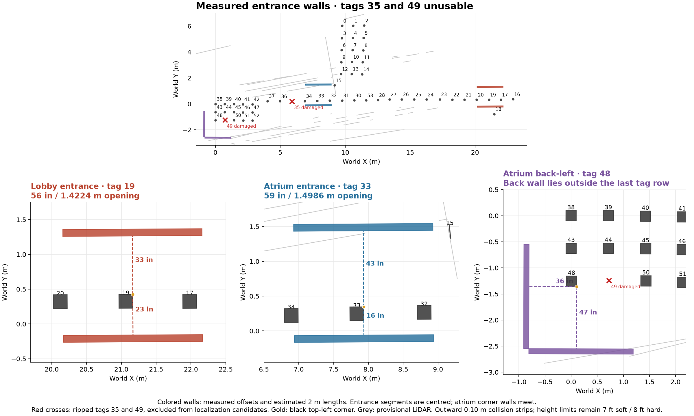

# Hardware navigation checkpoint

This checkpoint prepares three real-vehicle workflows: visit a named checkpoint,
take photos at several approved stops, and search or survey a measured area. It
uses the existing console, composed relay and vehicle adapters. The operator has
already tested lateral drone flight. Mapped navigation adds position in the shared
map, route-clearance checks and mission completion reporting to that control path.
Checkpoint navigation supports configured aircraft and Ohmni robots. The current
multi-stop photo and search/survey workflows use the aircraft execution path.

The owner approved the [53-tag map](../deployments/real-navigation/tag-map-53.json)
on 8 September 2026. The [approval record](../deployments/real-navigation/map-approval.json)
pins the exact snapshot. The original capture record remains unchanged so its
provenance survives. The owner supplied six wall offsets on 9 September and retained
the existing height limits. The offsets are incorporated into entrance wall geometry
and the staging package. Replacement tags and complete route clearance still need
verification during the map test.

On 9 September the owner reported tags 35 and 49 ripped and unusable. The
[availability record](../deployments/real-navigation/tag-availability-20260909.json)
excludes them from the staging package's 51 localization candidates. The console
preview marks both with red crosses. Their surveyed coordinates remain in the
53-tag baseline; candidates still require hardware verification before flight.

## Software verification

The combined loopback suite passed all five tests on 9 September 2026. It exercises
deployment setup, signed relay/device bootstrap, two arrived photo stops with both
images retrieved, a complete empty survey, and HOLD preventing a later photo stop.
The survey requires six GOTOs, a completed final HOVER, a completed mission and all
32 coverage cells. The node supplies synthetic motion and media through the real
relay WebSocket and navigation admission path.

The final source changes also passed 106 adapter/navigation/search regressions and
29 position and HOVER checks. A broad relay/planner run passed 1,658 tests and found
two outdated fixture expectations; after correction, the affected search, fleet and
map API group passed all 18 tests. Console verification passed 1,199 tests, lint,
the production build and the M14 browser mission. Android unit and signed-frame
interoperability checks cover the phone changes separately. Repository-wide CI is
reported on the checkpoint PR.

## What to prepare for the map test

The [recorded wall measurements](../deployments/real-navigation/wall-measurements-20260909.json)
start at the black square's top-left corner. Tags 19 and 33 use directions relative
to the upright printed tag. Tag 48's back and left refer to the back-left of the
atrium, as clarified by the owner and recorded in the earlier survey. The generated
geometry converts the corner offsets through the saved tag transforms using the
retained 7.87-inch black-square size.

| Tag | Wall direction | Distance |
| --- | --- | --- |
| 19 | Right | 23 in |
| 19 | Left | 33 in |
| 33 | Right | 16 in |
| 33 | Left | 43 in |
| 48 | Back | 47 in |
| 48 | Left | 36 in |

The owner retained the 7 ft soft and 8 ft hard height limits. These are flight-policy
limits; any lower obstacle still constrains the measured route geometry.

The [wall geometry](../deployments/real-navigation/entrance-wall-geometry.json)
contains six finite segments. The lobby opening at tag 19 is 56 inches (1.4224 m);
the atrium opening at tag 33 is 59 inches (1.4986 m). Their two-metre segments are
centred on the measured wall points. The two tag-48 walls meet at their calculated
back-left intersection and extend two metres along the room boundary. These lengths
are the owner's estimate, rather than a complete room perimeter.

The [world-bundle obstacle document](../deployments/real-navigation/entrance-obstacles.yaml)
turns those faces into outward 0.10 m collision strips across the retained flight
height range. That strip depth is a modeling choice, not measured wall thickness.
The strips preserve the measured opening widths. Import or merge this obstacle
document when assembling the full world bundle; the staging package includes the
same geometry. The provisional LiDAR overlay supplies comparison context and does
not move the measured walls.



| Input | Record | Used by |
| --- | --- | --- |
| Route walls and obstacles | Wall endpoints, clear corridor widths, furniture and other excluded volumes in the map frame | Continuous route and aircraft-envelope clearance |
| Heights | Floor elevation, lowest ceiling or overhead obstacle, and allowed flight-height interval along each segment | Geometry generation and flight limits |
| Replacement tags | ID, center position and printed orientation; preserve the old geometry only if replacement matches it | Camera localization and checkpoint identity |
| Drone registration | Each aircraft ID, connection epoch, phone build and world-to-local transform | Command admission and telemetry association |
| Camera measurements | Delivered image dimensions, intrinsics, body/gimbal transform and frame-time uncertainty | Tag localization, photo provenance and search positions |
| Control telemetry | Observed heading and velocity update intervals against the configured freshness limits | Mapped-flight admission and continued motion |
| Position stream timing | Observed position disagreement during movement and the timing of adapter and localization updates | Arrival tolerance within the reserved tracking allowance |
| Route timing | Longest segment, commanded speed, stopping and arrival-hold time | Consistent signed authorization, tracking and segment-completion limits |
| Operator activity window | Maximum allowed time since a confirmed operator intent | Mission admission and continued execution |

The map uses tag 38 as origin, positive X toward tag 39 and positive Z upward.
Local takeoff-relative altitude and elevation in this map are different values.
Keep the existing 7 ft soft and 8 ft hard ceilings in the flight profile; a lower
measured clearance further restricts an individual route.

Replacing or moving a tag changes the measured installation. Update the affected
map record and regenerate its dependent artifacts when the replacement no longer
matches the approved snapshot. Do not reuse the old digest for edited coordinates.

## Prepare the deployment

Regenerate the staging record from the repository root:

```sh
uv run python -m tools.prepare_real_navigation_package \
  --source deployments/real-navigation/tag-map-53.json \
  --map-approval deployments/real-navigation/map-approval.json \
  --wall-measurements deployments/real-navigation/wall-measurements-20260909.json \
  --tag-availability deployments/real-navigation/tag-availability-20260909.json \
  --output deployments/real-navigation/real-navigation-staging.json
```

This records the accepted tag baseline and remaining measurements. It does not
produce an executable flight configuration. The formation drafts in this file
retain their own two-aircraft and clearance requirements; they are outside the
three workflows being completed here.

Regenerate the separate wall geometry and obstacle document with:

```sh
uv run python -m tools.entrance_wall_geometry \
  --tag-map deployments/real-navigation/tag-map-53.json \
  --measurements deployments/real-navigation/wall-measurements-20260909.json \
  --output deployments/real-navigation/entrance-wall-geometry.json \
  --obstacles-output deployments/real-navigation/entrance-obstacles.yaml
```

Use the [world-bundle tools](WORLD_BUNDLE.md) and
[geometry authoring tools](MAP_GEOMETRY_TOOLS.md) to incorporate the measurements.
Then bind the resulting map, geometry, allowed destinations, speed and stopping
bounds, localization identities and selected vehicles in the navigation deployment.
A checkpoint needs an arrival position and height that fit the measured volume.
A named tag alone supplies no flight clearance.

The relay checks agreement between adapter position and the signed control pose.
Adapter telemetry carries its publication time; it does not carry the position
measurement time retained on Android. Measure disagreement during movement before
choosing the deployment's position tolerance, and keep that tolerance within the
reserved tracking allowance. Publication times alone cannot establish sample
alignment.

Size each signed route authorization and segment timeout for the approved speed,
segment length and arrival hold. `operator_timeout_ms` is an explicit safety-policy
input. The relay refreshes operator activity on console intents; an open browser
connection and status polls do not renew it. Choose that window for the supervised
workflow before the test and verify its expiry behavior.

The field environment needs these existing configuration inputs:

| Setting | Value |
| --- | --- |
| `SWEEP_ADAPTER_BACKEND` | `remote` |
| `SWEEP_PLANNING_JSON`, `SWEEP_SAFETY_JSON` | Measured world-motion policy |
| `SWEEP_NAVIGATION_CONFIG` | Signed aircraft navigation deployment |
| `SWEEP_CONTROL_LOCALIZATION_JSON` | Current device, frame, source and clock bindings |
| `SWEEP_GROUND_NAVIGATION_CONFIG`, `SWEEP_GROUND_NAVIGATION_KEY_FILE` | Ground deployment and private approval key when testing Ohmni routes |
| `SWEEP_SEARCH_CONFIG` | Permitted areas, camera coverage policy and source IDs |
| `SWEEP_SEARCH_DETECTION_CONFIG` | Matching camera streams, calibration and detector artifact |

Clear `SWEEP_SUPERVISED_VERTICAL_JSON` when selecting the world-navigation policy.
Use the composed `relay.main` entry point for execution. The standalone `relay.app`
entry point has no planner/adapter composition. Keep device and localization keys
in private host configuration.

Load the private field settings into the process environment, then validate them
without starting a relay or moving a vehicle:

```sh
uv run python - <<'PY'
from relay.autonomy import AutonomyConfig
from relay.settings import RelaySettings

RelaySettings.from_env()
AutonomyConfig.from_env()
print("Relay and autonomy configuration accepted")
PY
```

Export each aircraft's verified navigation admission files with
`tools.export_phone_navigation_admission`. Its CLI takes the deployment path,
device ID, private provenance-key file and output directory. Install the matching
admission bundle with the phone build before testing that aircraft. See the
[control-localization protocol](CONTROL_LOCALIZATION_PROTOCOL.md) for frame and
clock semantics.

Saved map artifacts remain available through authenticated map HTTP endpoints
after a relay restart, including load, save, validation, approval and comparison.
The previous control session remains closed: navigation and localization recording
require a live session. The console's platform discovery still requires that live
session, so archived HTTP access does not provide console session recovery.

## Exercise the workflows

1. In **Control → Navigate**, select one ready vehicle and an accepted destination.
   Review and confirm the route. Verify physical arrival and the completed state,
   then repeat with HOLD during travel. Fold the second drone and Ohmni checks into
   the same map test after their identities and transforms are loaded.
2. In **Captures**, select one aircraft and ordered photo stops, review their routes and confirm.
   Verify that each stop produces its own retrieved image after arrival. Interrupt
   another run with HOLD; it must stop the active route and leave later stops
   unexecuted.
3. In **Search**, select a configured aircraft, an area and either **Search for object** or
   **Survey coverage**. Verify completed coverage, returned findings and the empty
   result when no target is seen. Exercise camera loss and cancellation. A failed
   camera or route must produce an explicit terminal result.

Keep the console result, relay audit, vehicle log, map/configuration digests and
observed outcome together for each run. A command acknowledgement alone does not
establish arrival or successful image retrieval.

## Collision and sensing limits

Mapped routes check static measured clearance. Search reports objects from camera
frames. DJI lists a downward vision system for the Mini 3; its specifications do
not provide forward wall sensing. The current detector and video path cannot
establish automatic protection against newly appearing obstacles. Keep that
distinction explicit during the map test. See the
[research findings](../RESEARCH/REAL_VEHICLE_NAVIGATION_2026_09_08.md) for the source
evidence and the failure paths checked in this checkpoint.

Further formation changes, fleet mission allocation and language work are outside
this field-test scope.
