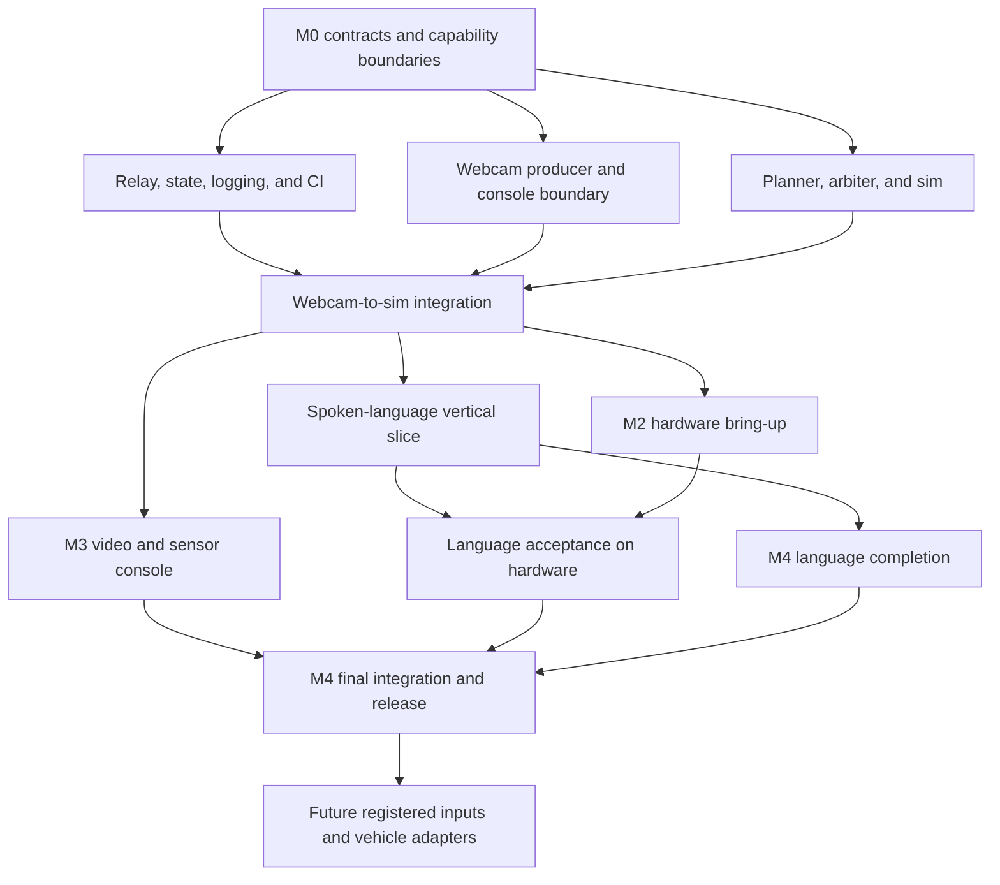

# Sweep MVP delivery plan

This plan turns the PRD into issue-ready work without creating a second delivery taxonomy. M0 through M4 are the canonical milestones. The complete initial MVP is the combined M1, M2, and M3 exit: an operator controls 4 to 6 indoor drones by webcam gesture or spoken natural language, every command passes the deterministic safety path, and the laptop console shows live cameras, telemetry, and sensor events. Hardware claims remain gated on recorded M2 evidence.

Interaction, Autonomy, and Platform are capability areas for coordination and module boundaries. They are not assigned to people for the capstone. Any engineer may claim a ready item and owns that item through review, integration, and acceptance evidence.

Dynamic claiming has one safety exception. Changes to shared contracts or safety-critical code have one named change owner per change and require cross-review before merge. This applies to Intent v1, the adapter interface, relay state shape, the arbiter, e-stop, and safety-relevant planner paths.

## Milestone reconciliation

The older Phase 0 through Phase 6 labels are retired for delivery planning. They map to the canonical sequence as follows:

| Canonical milestone | Legacy scope absorbed | Outcome |
|---|---|---|
| M0: Scope and contracts | Phase 0 evidence and the Phase 1 contract freeze | MVP boundary, frozen contracts, capability-area boundaries, and CI skeleton |
| M1: Sim control MVP | Phase 1 plus the narrow spoken-language slice formerly in Phase 5 | Webcam and live microphone speech traverse relay, planner, arbiter, and sim |
| M2: Hardware control MVP | Phase 2 and the delivery-gated hardware lane | The same control paths run safely on 4 to 6 real drones |
| M3: Full MVP, video and sensor console | Phase 3 | Cameras, telemetry, sensor events, focus, and detection complete the initial MVP; provisionally runs beside M4 |
| M4: Language completion and final proof of concept | Remaining Phase 5 language breadth plus Phase 6 hardening | Full eval corpus, resolvers, fallback, release evidence, and demo; provisionally runs beside M3 |
| Future | Phase 4 glasses work, Band work, and vehicle portability | Optional registered inputs and additional vehicle adapters |

The old labels should appear only in this mapping. New plans, issues, and status reports use M0 through M4.

## Dependency map

M2 may run beside the language half of M1 after the webcam-to-sim gate is green. Koby has provisionally directed M3 video and M4 language completion to run in parallel after that same gate, pending team confirmation of the capacity gap below. The complete MVP claim waits for both M2 hardware evidence and M3 console evidence.

## Work breakdown

Each item below has enough boundary and acceptance detail to become an issue later. Dependencies refer to other item IDs in this plan.

### M0: Scope and contracts

**M0.1: Freeze the MVP boundary and capability areas**
Capability area: team. Dependencies: none.
Scope: approve the 4-to-6-drone core MVP, move glasses and the Band to Future, make spoken language the second control path, and adopt dynamic task claiming with the contract and safety exception above.
Done when: the PRD has one milestone scheme, every core deliverable has a capability area and dependency boundary, and no optional input blocks M1 through M4.

**M0.2: Freeze executable contracts**
Capability area: Platform, with Interaction and Autonomy review. Dependencies: M0.1.
Scope: freeze Intent v1, telemetry, adapter, WebSocket, source-registry, and repository contracts; establish the shared input conformance runner and CI skeleton.
Done when: webcam fixtures exercise the real validator, unknown sources and invalid payloads are rejected, and planner motion semantics match the intent schema.

### M1: Sim control MVP

**M1.1: Build relay state, logging, and replay**
Capability area: Platform. Dependencies: M0.2.
Scope: authenticate registered sources, validate and stamp intents, maintain authoritative swarm state, fan out telemetry, append JSONL, and replay a session.
Done when: a restarted relay reconstructs state from adapter telemetry and a session replay reproduces its ordered intent and state history.

**M1.2: Build the deterministic autonomy and safety path**
Capability area: Autonomy. Dependencies: M0.2.
Scope: implement planner behaviors, the arbiter, the sim adapter, battery and link-loss behavior, and the scripted scenario suite.
Done when: every intent and planned command is checked, unsafe requests are refused, and the sim scenarios pass deterministically.

**M1.3: Connect the webcam console to Intent v1**
Capability area: Interaction. Dependencies: M0.2, M1.1.
Scope: isolate the real event-to-intent boundary, remove production use of the internal simulator, add ledger, health, and replay views, and run the shared conformance suite.
Done when: webcam and keyboard events produce accepted Intent v1 payloads and disconnects or send failures are visible without substitute commands.

**M1.4: Pass the webcam-to-sim gate**
Capability area: team. Dependencies: M1.1, M1.2, M1.3.
Scope: run Appendix E through the production relay, planner, arbiter, and sim path.
Done when: 4 to 6 simulated drones complete the mission in under three minutes, CI is green, and the log contains zero unsafe intents.

**M1.5: Build the transcript-to-plan compiler path**
Capability area: Platform. Dependencies: M1.1, M1.2, M1.4.
Scope: use one pinned model to produce ordered Intent v1 plans from final speech transcripts and authoritative relay state; validate, log, and emit confirmed intents one at a time.
Done when: models cannot emit adapter commands, invalid plans emit nothing, and compiler input, output, validation, operator decision, and usage are replayable.

**M1.6: Capture speech and add preview, clarification, and confirmation**
Capability area: Interaction. Dependencies: M1.3, M1.5.
Scope: add one-shot push-to-talk recording to the pinned Chromium demo browser; upload recordings of at most 30 seconds to a relay endpoint; transcribe through the OpenAI Whisper API; show the final transcript; add plan preview, clarification, confirm, cancel, and explicit permission, capture, upload, timeout, rate-limit, service, and network error states. Keep `OPENAI_API_KEY` in the relay process environment.
Done when: three live spoken multi-step orders reach plan preview, no language intent emits before confirmation, transcription failures emit nothing, the browser never receives the API key, and ambiguous requests present choices or a refusal.

**M1.7: Establish the provisional language eval**
Capability area: Platform, with team-contributed cases. Dependencies: M1.5, M1.6.
Scope: create 50 reviewed transcript-to-plan cases for the scripted mission, three multi-step orders, ambiguity, confirmation-sensitive requests, and unsafe requests; add a manual 20-utterance clean-room speech smoke run across two speakers; support cached CI and an explicit live compiler refresh.
Done when: exact-match plan accuracy is at least 85%, the live speech smoke run reaches at least 85% exact transcript match, unsafe-intent count is zero, and three spoken multi-step orders pass through the complete sim path.

#### Does spoken language fit Sept 5 to 9?

**Recommendation: yes, within the bounded M1 speech scope.** Whisper API capture and transcription add about 1.5 to 2 person-days beyond the reviewed transcript-to-plan slice. The five-day window provides 15 gross team-days under the PRD's calendar assumption. M1 needs about 8.5 to 11.5 team-days when browser recording, relay upload, server-side key handling, transcription and cost logging, error states, a manual smoke run, compiler integration, preview and confirmation, and integration margin are counted together.

That estimate holds for one-shot push-to-talk in the pinned Chromium browser, `en-US`, a working microphone and network, recordings capped at 30 seconds, and the `whisper-1` transcription endpoint. The final transcript enters the same compiler path that typed fixtures exercise. M4 owns offline transcription, continuous listening, multilingual support, and noisy-room hardening.

The Whisper path needs browser recording plus a relay endpoint because the API accepts an audio-file upload and the API key must stay off the client. OpenAI prices `whisper-1` transcription at [$0.006 per minute](https://developers.openai.com/api/docs/models/whisper-1). A 30-second command therefore contributes at most $0.003 to the $0.05 combined transcription-plus-compiler budget. The relay logs audio duration, transcription cost, compiler cost, and the combined total for every command. OpenAI's [API key safety guidance](https://help.openai.com/en/articles/5112595-best-practices-for-api-key-safet) requires requests from browser clients to pass through a server that holds the key.

The 50 reviewed cases test transcript-to-plan behavior in CI. Microphone recognition evidence comes from the separate 20-utterance, two-speaker live run through the real browser capture path. Synthetic transcripts cannot satisfy speech acceptance.

### M2: Hardware control MVP

**M2.1: Select and prove the hardware adapter**
Capability area: Autonomy. Dependencies: M1.4, delivered hardware, positioning, and a guarded flight space.
Scope: inventory the drones, choose the adapter, calibrate positioning, verify ground telemetry, and record the bring-up checklist.
Done when: the selected adapter reports stable telemetry and the adapter choice and positioning evidence are recorded.

**M2.2: Add hardware watchdog and session evidence**
Capability area: Platform. Dependencies: M1.1, M2.1.
Scope: add operator-presence enforcement, hardware log capture, and end-of-session reports. Schedule this after the M1 compiler-to-sim path if both compete for the same week.
Done when: stale operator presence triggers the configured safe behavior and the report contains commands, refusals, telemetry, and timing.

**M2.3: Complete staged flight acceptance**
Capability area: Autonomy, with bounded Interaction and Platform support. Dependencies: M1.4, M2.1, M2.2.
Scope: accept one drone, then three, then 4 to 6; exercise arm, takeoff, hold, land, come home, e-stop, battery return, link loss, spacing, formation, sweep, and geofence refusal.
Done when: 4 to 6 drones pass Appendix E five consecutive times and every deliberate unsafe request produces the expected refusal.

**M2.4: Repeat language acceptance on hardware**
Capability area: team. Dependencies: M1.7, M2.3.
Scope: run the three M1 multi-step language orders through the hardware adapter.
Done when: plans, commands, refusals, and operator decisions match the sim acceptance within hardware tolerances.

### M3: Full MVP, video and sensor console

**M3.1: Establish media ingest and recording**
Capability area: Platform. Dependencies: M1.1 and one camera source.
Scope: configure MediaMTX ingest, WebRTC and MJPEG serving, recording, stream naming, and latency measurement.
Done when: one source streams and records reliably within the latency budget; 4-to-6-source claims remain blocked until hardware evidence exists.

**M3.2: Build the camera and sensor dashboard**
Capability area: Interaction. Dependencies: M1.3, M3.1.
Scope: add the live mosaic, focus pane, focus-by-selection, telemetry and sensor state, attention state, and clear degraded-source status.
Done when: the operator can select a drone, inspect its live camera and sensor state, and see stream or telemetry failures without affecting flight control.

**M3.3: Add detection events and operator confirmation**
Capability area: Interaction with Platform integration. Dependencies: M3.1, M3.2.
Scope: sample frames, run the detector, emit timestamped detection events, promote attention, and require operator confirmation before detections affect swarm behavior.
Done when: a qualifying detection promotes the selected feed within one second, all events are logged, and no detection emits a command.

**M3.4: Earn the complete MVP exit**
Capability area: team. Dependencies: M2.4, M3.2, M3.3.
Scope: demonstrate webcam or spoken-language control with the camera, telemetry, and sensor console active.
Done when: the complete operator workflow succeeds on 4 to 6 drones and the session evidence supports every control, safety, video, and sensor claim.

### M4: Language completion and final proof of concept

**M4.1: Complete deterministic language resolution**
Capability area: Autonomy. Dependencies: M1.7 and stable relay state.
Scope: implement bounded selection and location resolution with explicit ambiguity and refusal results.
Done when: resolver tests cover IDs, current selection, supported relative phrases, stale state, ambiguity, and unresolved locations without bypassing the planner.

**M4.2: Complete language evaluation and fallback**
Capability area: Platform, with team-contributed cases. Dependencies: M1.7. Resolver-dependent cases also depend on M4.1.
Scope: expand to the responder-reviewed 200-item set, complete cached and live eval paths, add the local compiler fallback, and close compiler failure cases. Corpus authoring, cached fixtures, and non-resolver cases proceed beside M4.1; resolver cases join after its result contract freezes.
Done when: exact-match accuracy remains at least 85%, unsafe-intent count is zero, cached fixtures are produced by real compiler runs, and fallback uses the same validation path.

**M4.3: Harden speech UX and evaluate offline transcription**
Capability area: Interaction with Platform support. Dependencies: M1.6.
Scope: evaluate noisy-room speech, retries, timeouts, and a local transcription fallback if offline evidence requires it; polish transcript, preview, clarification, confirmation, and refusal behavior.
Done when: the primary Whisper API path and any approved local fallback feed the same transcript-to-plan path and cannot bypass preview, confirmation, planner, or arbiter checks.

**M4.4: Harden, document, and release**
Capability area: team. Dependencies: M2.4, M3.4, M4.2, M4.3.
Scope: run failure drills and adversarial tests, finish the build guide and operator docs, cut the demo reel, and tag v0.1.
Done when: all claimed hardware and software exits have recorded evidence, CI is green, and the public release is reproducible from the guide.

### Future

**F.1: Add optional input sources**
Capability area: Interaction with Platform registration support. Dependencies: M4.4 and a concrete source with host access.
Scope: add glasses or an EMG band through a source-specific producer, registry entry, and shared conformance runner.
Done when: real source events pass Intent v1 conformance and the production safety path without relay, planner, arbiter, or adapter redesign.

**F.2: Extend vehicle portability**
Capability area: Autonomy with Platform eval support. Dependencies: working M2 evidence and the capability/action eval harness.
Scope: evolve capability contracts and add one evidence-backed vehicle adapter at a time.
Done when: unsupported behavior returns a typed refusal and no input or model calls an adapter directly.

## Concurrent M3 video and M4 language decision

**Capacity analysis: the Sept 5 to 12 window is short by 3 to 8 person-days. Provisional decision: run both lanes concurrently pending team confirmation.** The two feature sets have no hard sequential dependency on each other after M1 establishes the relay, authoritative state, Intent v1, planner, arbiter, sim, and console shell. Dynamic claiming creates more scheduling options, but it does not reduce the total work or remove shared-file and review gates.

| Work package | Estimated team effort | Parallelization boundary |
|---|---:|---|
| Full language compiler, state context, validation, logging, ordered emission, and eval plumbing | 4 to 5 person-days | Plan schema, relay state shape, and ordered emission use one change owner and cross-review. |
| Whisper API capture, language UI, full resolvers, corpus completion, offline evaluation, and speech hardening | 5 to 6 person-days | Corpus writing and the live speech smoke run can fan out. Resolver and UI integration wait on frozen result envelopes. |
| Media ingest, recording, stream naming, detection-event transport, and latency measurement | 3 to 4 person-days | Media configuration can proceed independently. Detection and relay-state changes use one change owner and cross-review. |
| Mosaic, focus, sensor state, detector, attention promotion, and confirmation | 4 to 5 person-days | Detector experiments can run independently. Console integration overlaps the language UI files. |
| Cross-stack review, end-to-end acceptance, and defect margin | 2 to 3 person-days | Safety-path and shared-contract reviews cannot be self-approved or merged concurrently. |

The combined range remains 18 to 23 person-days because Whisper was already included in the full-language estimate; moving it into M1 changes sequencing rather than total scope. Sept 5 through Sept 12 contains five normal weekdays, or 15 gross person-days for three engineers. The capacity gap is 3 to 8 person-days before hardware support. Treating all eight calendar days as work provides 24 gross person-days before M1 carryover, review, and defects. Dynamic claiming helps isolated work start sooner, while the plan schema, relay state, ordered emission, safety-path review, detection-event shape, and shared console integrations still serialize part of the work.

The freely parallelizable pieces are MediaMTX setup, detector prototyping, corpus authoring, and compiler evaluation fixtures after their input contracts freeze. Safety- or contract-gated pieces are Intent v1 and plan-schema changes, relay state and detection-event shapes, `validate_plan` and ordered emission, arbiter or e-stop changes, and safety-relevant planner work. Each gated change has one named change owner and a different reviewer.

The provisional concurrent schedule is:

1. Sept 5: freeze the transcription request/response, plan result, detection-event, and stream-naming contracts. Each contract has one change owner and a different reviewer.
2. Sept 5 to 9: complete M1 Whisper capture and compiler integration. In parallel, claim MediaMTX setup, detector prototyping, corpus authoring, cached eval fixtures, and speech smoke preparation.
3. Sept 10 to 12: integrate the M3 console and detection path beside M4 resolvers, the 200-item eval, local compiler fallback, and speech hardening. Shared console changes merge through one owner at a time.
4. Continue delivery-gated M2 work in booked blocks. Hardware work reduces the capacity available to the concurrent lanes and increases the documented gap.
5. Sept 12: the team confirms added capacity or records the revised exit date. Parallel scheduling leaves the 3-to-8-person-day gap in place.

This schedule preserves Koby's concurrent direction and the original capacity finding. It is provisional until the team confirms how it will cover the gap.
