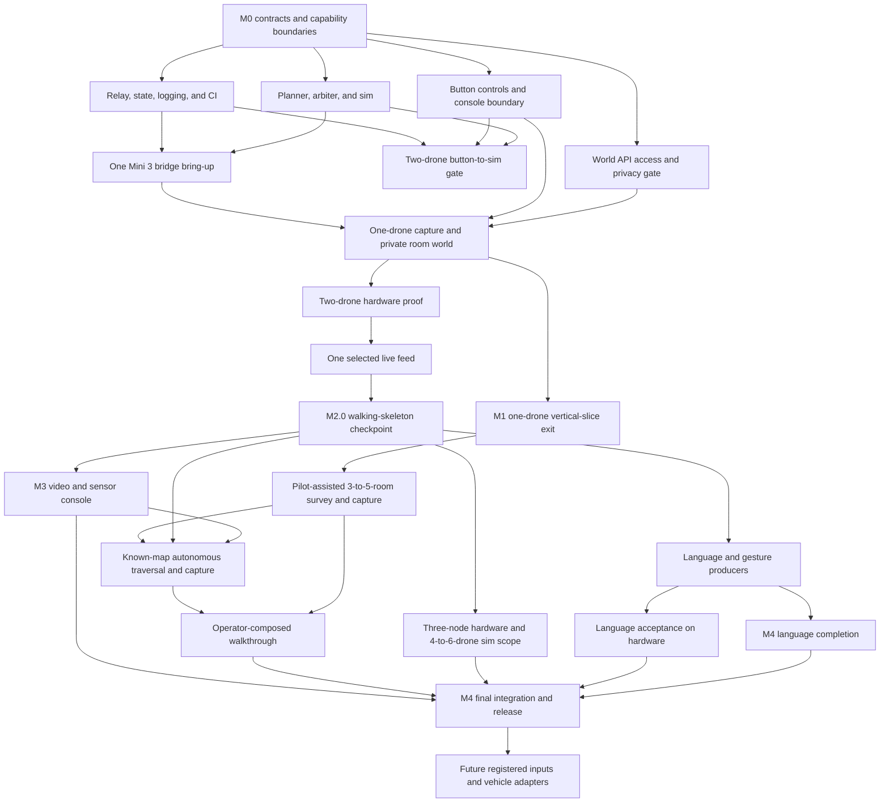

# Sweep MVP delivery plan

This plan turns the PRD into issue-ready work without creating a second delivery taxonomy. M0 through M4 are the canonical milestones. The proven three-guided-phone-photo flow is completed precursor evidence and a fallback. M1 first proves the pending product loop: a button-generated `capture_room` request passes through Sweep and one Mini 3 bridge node to create a private Marble room world. M2.0 adds a second real node, then M2 completes the three-node physical target while 4 to 6 drones remain in simulation. Language and gesture producers follow the button path. Later gates add known-map autonomous multi-room traversal and capture and an operator-composed walkthrough. The complete MVP exits M4.

Interaction, Autonomy, and Platform are capability areas for coordination and module boundaries. They are not assigned to people for the capstone. Any engineer may claim a ready item and owns that item through review, integration, and acceptance evidence.

Dynamic claiming has one safety exception. Changes to shared contracts or safety-critical code have one named change owner per change and require cross-review before merge. This applies to Intent v1, the adapter interface, relay state shape, the arbiter, e-stop, and safety-relevant planner paths.

## Dependency map

The manual three-photo flow is already proven and does not gate pending work. M1 connects one paid World API request, button controls, the relay, planner, arbiter, camera sim, one Mini 3 bridge node, and one drone capture into the first user-visible exit. M2.0 then adds the second real node and selected live feed; language and gesture producers start after that checkpoint. The physical MVP expands to three matching nodes while 4 to 6 drones remain in simulation and Future hardware work. The complete MVP claim waits for control, media, known-map autonomous multi-room traversal and capture, and composed-walkthrough evidence.

## Work breakdown

Each item below has enough boundary and acceptance detail to become an issue later. Dependencies refer to other item IDs in this plan.

### M0: Scope and contracts

**M0.1: Freeze the MVP boundary and capability areas**
Capability area: team. Dependencies: none.
Scope: approve three DJI Mini 3, RC-N1, and Android bridge nodes as the physical core MVP, retain 4 to 6 drones in simulation and Future hardware expansion, make console buttons the reference producer, stage spoken language and gestures afterward, move the Band to Future, and adopt dynamic task claiming with the contract and safety exception above.
Done when: the PRD has one milestone scheme, every core deliverable has a capability area and dependency boundary, and no optional input blocks M1 through M4.

**M0.2: Draft and freeze executable contracts**
Capability area: Platform, with Interaction and Autonomy review. Dependencies: M0.1.
Scope: freeze Intent v1 including `capture_room`, `survey_area`, and `map_area`; telemetry, flight and camera adapters, pose-anchored capture-bundle, WebSocket, source-registry, repository, `building`, `room`, and `capture` contracts; draft the World API-dependent `generation_job` fields; establish the shared input conformance runner and CI skeleton. The flight interface includes acknowledged yaw control. The camera interface includes capability discovery, gimbal positioning, readiness, native panorama, component capture, media retrieval, and typed unsupported results.
Done when: console-button fixtures exercise the real validator, unknown sources and invalid payloads are rejected, planner motion semantics match the intent schema, `capture_room` requires confirmation and exactly one selected aircraft, `survey_area` authorizes recording and annotation but no autonomous motion, `map_area` requires confirmation and supplied map and room-graph inputs, every non-vendor state transition has one defined owner and terminal result, and the provisional World API fields are marked for M0.3 validation.

**M0.3: Prove World API access**
Capability area: Platform. Dependencies: M0.2, paid World API account and key.
Scope: submit one real `marble-1.1` multi-image request with three images and explicitly set `public: false`, `allow_id_access: false`, `allowed_readers: []`, and `allowed_writers: []`. Poll the operation and record the upload, permission, operation, result, asset, duration, and settled-credit shapes without logging the returned Marble URL. Revise the provisional records to match that evidence and freeze the `generation_job` contract. The Marble web app and mocked responses provide development evidence only.
Done when: the real job reaches `done=true` and returns a world ID, `world_marble_url`, and asset metadata; the owner can open it while an unauthenticated browser and a second account cannot; the observed fields have contract fixtures; and the reviewed record schema is frozen. If API access is unavailable, M1.0 remains blocked.

### M1: One-drone room-world vertical slice

**M1.0: Earn the one-drone room-world exit**
Capability area: team. Dependencies: M0.3, M1.1, M1.2, M1.3, M1.9.
Scope: let the operator create a room, have the RC safety operator pilot one connected Mini 3 to an approved hover pose, click Capture room, review the generated `capture_room`, and confirm it. The button emits the same Intent v1 envelope later sources use. The planner and arbiter dispatch only to the proven bridge. M1 permits capture yaw and gimbal actions but no autonomous translation. The drone holds the approved pose, collects `pano_360` if verified or a separately confirmed `reconstruct_8`, downloads pose-anchored media, and starts one explicitly private Marble job. Show asynchronous states and retry without losing the capture.
Done when: the complete button request reaches a visible room world with matching room, capture, operation, world, asset, model, cost, permission, and timestamp records. Before confirmation, a non-command `capture_readiness` event reports pose, pilot-approved clearance, camera, storage, image quality, and coverage readiness plus a yaw or gimbal suggestion. The Android app shows local FPV, the coverage compass, readiness gates, and capture progress. The persistent laptop shell exposes Control, Live view, Capture library, World Builder, Connectivity, and Configuration modules at their M1 depth. `pano_360` accepts only a full equirectangular artifact; `reconstruct_8` remains labeled as incomplete vertical coverage. Owner access succeeds while unauthenticated and second-account access fail. Injected invalid intent, stale command, telemetry, camera, download, link, bridge, and World API failures take the documented refusal, hold, or recovery path. The physical RC safety operator can pause, take over, return, or land throughout.

#### Completed precursor: manual three-photo capture

The team has already proven that three guided phone photos can create one Marble room world. Preserve the photos, output, and observed quality as feasibility evidence. This manual path remains the fallback when drone capture is unsupported or unsafe, but it is not a pending deliverable or dependency.

**M1.1: Build relay state, logging, and replay**
Capability area: Platform. Dependencies: M0.2.
Scope: first establish one authenticated WebSocket session, canonical two-drone state, acknowledgements and refusals, append-only JSONL, and basic CI for M2.0. State fan-out and backend replay follow on the same contracts.
Done when: the checkpoint path authenticates the console and keyboard sources, logs every accepted or refused intent and acknowledgement, and reconstructs canonical state from adapter telemetry. Backend replay later reproduces the ordered intent and state history; replay UI is outside M2.0.

**M1.2: Build the deterministic autonomy and safety path**
Capability area: Autonomy. Dependencies: M0.2.
Scope: start with a two-drone flight sim and planner support for `arm`, `select`, `takeoff`, `translate`, `hold`, `come_home`, `land_all`, and `estop`. Add a concrete simulated camera implementation with deterministic full-equirectangular and eight-frame fixtures plus injected unsupported-capability, camera, and download failures. Keep the full Intent v1 schema; preserve the M1-approved `capture_room` path during M2.0 and return `unsupported` for the remaining unearned names. Implement the complete arbiter checks for state, confirmation, geofence, ceiling, spacing, battery, link loss, positioning loss, and e-stop.
Done when: every checkpoint intent and planned command is checked, unsupported valid intents produce a typed refusal before planning, unsafe requests produce no adapter command, the camera protocol runs against the simulated implementation, and the two-drone scenarios pass deterministically. Camera fixtures prove `pano_360` and `reconstruct_8` result typing and failure handling before hardware. `come_home` remains planner behavior expressed through the existing adapter methods.

**M1.3: Connect button controls to Intent v1**
Capability area: Interaction. Dependencies: M0.2, M1.1.
Scope: isolate the real event-to-intent boundary and remove production use of the internal simulator. Build a Control/Capture module with a connected-aircraft selector, capture-pattern selector, readiness reasons, `Capture room`, `Hold`, and supplemental network `E-stop` controls, plan preview, confirmation, and cancellation. For M2.0, show connection, selection, two drone states, the last acknowledgement or refusal, keyboard network stop, and a slot for one selected live feed. Ledger, health, and replay views follow after the checkpoint.
Done when: console-button and keyboard events produce accepted Intent v1 payloads; each request retains one event ID and timestamps through draft, pending confirmation, sent, accepted or refused, executing, and completed or failed; every refusal or failure reason is visible; the checkpoint state is visible; and disconnects or send failures are shown without substitute commands or silent retry.

**M1.4: Pass the two-drone button-to-sim gate**
Capability area: team. Dependencies: M1.1, M1.2, M1.3.
Scope: run the M2.0 workflow through the production button controls, relay, planner, arbiter, and two-drone sim path: arm, select both, confirmed takeoff, translate together, hold, come home, confirmed land-all, with the network stop available throughout.
Done when: the workflow passes in simulation, a deliberate geofence violation is refused before an adapter command, e-stop reaches both simulated drones, configured link loss produces the safe behavior, CI is green, and the JSONL log explains the run.

**M1.5: Expand the sim path to the full scripted mission**
Capability area: Autonomy with Interaction and Platform integration. Dependencies: M1.4, M2.0.
Scope: add the formation, altitude, spacing, and sweep behaviors deferred by M2.0; expand the simulator and console from two drones to 4 to 6; run Appendix E through the production path.
Done when: 4 to 6 simulated drones complete Appendix E in under three minutes and the log contains zero unsafe intents.

**M1.6: Build the follow-on transcript-to-plan compiler path**
Capability area: Platform. Dependencies: M1.0, M1.1, M1.2.
Scope: after the button-driven M1 exit, compile the bounded “Capture this room” utterance into `capture_room` from authoritative relay, selection, room, pose, and camera-sim state. Validate, log, preview, and emit only after confirmation. Extend to ordered multi-intent plans after M1.5 without changing the adapter boundary.
Done when: the narrow capture request passes the simulated planner and arbiter; models cannot emit adapter commands; invalid plans emit nothing; and compiler input, output, validation, operator decision, and usage are replayable.

**M1.7: Capture speech and add preview, clarification, and confirmation**
Capability area: Interaction. Dependencies: M1.3, M1.6.
Scope: add one-shot push-to-talk recording to the pinned Chromium demo browser; upload recordings of at most 30 seconds to a relay endpoint; transcribe through the OpenAI Whisper API; show the final transcript; add plan preview, clarification, confirm, cancel, and explicit permission, capture, upload, timeout, rate-limit, service, and network error states. Keep `OPENAI_API_KEY` in the relay process environment.
Done when: “Capture this room” reaches plan preview and explicit confirmation, no language intent emits before confirmation, transcription failures emit nothing, the browser never receives the API key, and ambiguous requests present choices or a refusal. The three multi-step mission orders are accepted later under M1.8.

**M1.8: Establish the provisional language eval**
Capability area: Platform, with team-contributed cases. Dependencies: M1.5, M1.6, M1.7.
Scope: create 50 reviewed transcript-to-plan cases for the scripted mission, three multi-step orders, ambiguity, confirmation-sensitive requests, and unsafe requests; add a manual 20-utterance clean-room speech smoke run across two speakers; support cached CI and an explicit live compiler refresh.
Done when: exact-match plan accuracy is at least 85%, the live speech smoke run reaches at least 85% exact transcript match, unsafe-intent count is zero, and three spoken multi-step orders pass through the complete sim path.

**M1.9: Prove one DJI Mini 3 bridge node**
Capability area: Autonomy with Platform support. Dependencies: M0.2, M1.1, M1.2, delivered Mini 3, RC-N1, and candidate Android phone.
Scope: pin and record the exact Mini 3, RC-N1, Android model, aircraft/controller firmware, and Mobile SDK release. Build the smallest DJI-specific authenticated pilot app and bridge; do not introduce a generic edge-agent or protobuf layer. Render the DJI feed locally with `visual_advisory` coverage, quality, and readiness overlays. Prove SDK registration and connection, Virtual Stick, required telemetry fields and measured rate, runtime camera capabilities, photo and panorama behavior, media download, live-video extraction, and disconnect/watchdog behavior. Stream Virtual Stick commands at a tested rate within DJI's documented 5-to-25 Hz range. Reject out-of-order commands and commands older than the frozen local TTL at the bridge.
Done when: one node completes a sustained 15-minute bench and guarded-hover run while recording command RTT, jitter, drops, telemetry rate, end-to-end video latency and dropped frames, phone thermals, throttling, and battery draw. WebRTC glass-to-glass p95 remains below 300 ms; the report breaks out aircraft-to-controller, Android processing, and LAN delivery. The phone sustains control, telemetry, live decode and LAN relay together. Physical RC pause, takeover, RTH, and landing remain available after laptop, LAN, relay, or bridge failure. Camera evidence reports what this exact combination returns; a panorama symbol alone does not accept `pano_360`. [DJI Mobile SDK release notes](https://developer.dji.com/doc/mobile-sdk-tutorial/en/?pbc=D3IDBfR5&pm=custom) · [DJI Virtual Stick](https://developer.dji.com/doc/mobile-sdk-tutorial/en/tutorials/virtual-stick.html) · [Mini 3 specifications](https://www.dji.com/mini-3/specs)

#### Drone capture geometry

The `reconstruct_8` pattern derives yaw spacing from `yaw_step <= measured_horizontal_fov * (1 - overlap_fraction)`. Forty percent overlap is the first experiment. DJI publishes an 82.1-degree lens field of view but does not identify it as horizontal field of view, so M1.9 measures the chosen camera mode and aspect ratio. Eight evenly spaced headings use a 45-degree yaw step and meet 40 percent overlap only when measured horizontal field of view is at least 75 degrees. Otherwise the pattern returns `unsupported` or uses a separately specified capture plan. A level yaw ring leaves floor and ceiling unseen and is labeled as incomplete vertical coverage. The `pano_360` pattern succeeds only with a valid full equirectangular artifact from the camera or a verified multi-row stitcher; otherwise it returns `unsupported`. The completed three-phone-photo flow remains a sparse manual fallback. [Mini 3 specifications](https://www.dji.com/mini-3/specs) · [DJI panorama tutorial](https://developer.dji.com/mobile-sdk/documentation/ios-tutorials/PanoDemo.html)

#### M1 room-world scope

The pending room-world slice uses Mini 3 capture in an empty, static room. Standard `marble-1.1` multi-image generation costs 1,600 API credits, currently $1.28 at $1 per 1,250 credits. A ten-room run costs $12.80 before retries. World Labs says accepted jobs usually take about five minutes, so every room is an asynchronous job. API billing and Marble web-app billing are separate. [World API pricing](https://docs.worldlabs.ai/api/pricing) · [World API rate limits](https://docs.worldlabs.ai/api/rate-limits)

The output is an AI-generated room world. It carries no claim about hidden geometry, measurements, inventory, or safety. Every request explicitly disables public, ID-based, reader, and writer access unless the owner selects named collaborators. The returned Marble URL is sensitive and stays out of logs. The team must decide source-photo, vendor-asset, and project-record retention and deletion before implementation. People and pets remain outside the M1 capture set.

#### Follow-on speech scope

**The follow-on speech scope is bounded on purpose.** Whisper API capture and transcription sit on top of the accepted button-driven intent path and the reviewed transcript-to-plan slice. They add browser recording, relay upload, server-side key handling, transcription and cost logging, error states, a manual smoke run, compiler integration, and preview and confirmation.

That scope holds for one-shot push-to-talk in the pinned Chromium browser, `en-US`, a working microphone and network, recordings capped at 30 seconds, and the `whisper-1` transcription endpoint. The final transcript enters the same compiler path that typed fixtures exercise. M4 owns offline transcription, continuous listening, multilingual support, and noisy-room hardening.

The Whisper path needs browser recording plus a relay endpoint because the API accepts an audio-file upload and the API key must stay off the client. OpenAI prices `whisper-1` transcription at [$0.006 per minute](https://developers.openai.com/api/docs/models/whisper-1). A 30-second command therefore contributes at most $0.003 to the $0.05 combined transcription-plus-compiler budget. The relay logs audio duration, transcription cost, compiler cost, and the combined total for every command. OpenAI's [API key safety guidance](https://help.openai.com/en/articles/5112595-best-practices-for-api-key-safet) requires requests from browser clients to pass through a server that holds the key.

The 50 reviewed cases test transcript-to-plan behavior in CI. Microphone recognition evidence comes from the separate 20-utterance, two-speaker live run through the real browser capture path. Synthetic transcripts cannot satisfy speech acceptance.

### M2: Hardware control MVP

**M2.0: Pass the two-drone walking-skeleton checkpoint**
M2.0 is the next control checkpoint after the M1 one-drone room-world exit. It spans M1.1 through M1.4, M2.1 and M2.2, and the selected-feed slice of M3.1 while remaining within the M0 through M4 milestone series.

The checkpoint exercises the eight flight-control Intent v1 names `arm`, `select`, `takeoff`, `translate`, `hold`, `come_home`, `land_all`, and `estop`. The M1-approved `capture_room` path remains available at an operator-approved hover pose. Other unearned names, including `map_area`, return `unsupported`; unknown names and invalid arguments keep their existing validation refusals. The workflow is:

1. Arm.
2. Select both drones.
3. Take off after confirmation.
4. Translate both together.
5. Hold.
6. Come home.
7. Land both after confirmation.
8. E-stop at any point.

The one-drone proof selects the only connected drone and runs the same sequence and safety checks. The two-drone proof then replaces that selection with both connected drones and verifies coordinated translation and spacing.

The checkpoint keeps the arbiter, network stop, state and confirmation checks, geofence, ceiling, spacing, battery, link-loss and positioning-loss behavior, append-only JSONL audit log, and independent physical RC safety path. One Sweep operator and one RC safety operator per active aircraft are present; a network e-stop does not satisfy this rule. The formation library, altitude gesture, sweep planner, detector, mosaic, language and LLM work, replay UI, metrics dashboard, session report, and release polish start after this gate.

M2.0 passes when:

- the complete workflow passes in the two-drone simulator;
- one real drone passes before the second is added;
- two real drones complete the workflow without manual flight correction;
- a deliberate geofence violation is refused before an adapter command is sent;
- the network stop reaches both drones, link loss produces the configured safe behavior, and each RC safety operator can pause, take over, return, or land independently;
- the selected live video feed stays visible; and
- the JSONL log explains accepted commands, refusals, acknowledgements, state changes, and safety actions.

**M2.1: Prove one-drone flight control**
Capability area: Autonomy. Dependencies: M1.0, M1.4, guards, and a contained flight space.
Scope: calibrate the accepted positioning and clearance systems, verify ground telemetry, and run the M2.0 workflow on the proven Mini 3 bridge node with one Sweep operator and one RC safety operator.
Done when: one Mini 3 completes the workflow with expected refusals and network-loss behavior, while physical RC pause, takeover, RTH, and landing remain independently available.

**M2.2: Prove two-drone hardware control**
Capability area: Autonomy, with bounded Interaction and Platform support. Dependencies: M1.4, M2.1.
Scope: duplicate the proven hardware stack for a second Mini 3 and run the eight-intent M2.0 workflow. Exercise spacing, geofence refusal, battery behavior, bridge and link loss, positioning loss, network stop, and physical RC takeover without adding the deferred feature set.
Done when: two real Mini 3 nodes complete the workflow without manual flight correction, every deliberate unsafe request produces the expected refusal, each bridge rejects stale and out-of-order commands, each physical RC remains usable, and the JSONL evidence explains the run.

**M2.3: Add hardware watchdog and session evidence**
Capability area: Platform. Dependencies: M1.1, M2.0.
Scope: add operator-presence enforcement, extended hardware log capture, and end-of-session reports. These are polished-MVP work after the checkpoint.
Done when: stale operator presence triggers the configured safe behavior and the report contains commands, refusals, telemetry, and timing.

**M2.4: Complete staged flight acceptance**
Capability area: Autonomy, with bounded Interaction and Platform support. Dependencies: M1.5, M2.2, M2.3.
Scope: expand from the accepted two-node checkpoint to three matching Mini 3, RC-N1, and Android nodes; add altitude, formation, and sweep to the accepted checkpoint behaviors. Keep the 4-to-6-drone proof in simulation.
Done when: three physical nodes pass Appendix E five consecutive times, 4 to 6 simulated drones pass the same scenarios, and every deliberate unsafe request produces the expected refusal.

**M2.5: Repeat language acceptance on hardware**
Capability area: team. Dependencies: M1.8, M2.4.
Scope: run the three M1 multi-step language orders through the hardware adapter.
Done when: plans, commands, refusals, and operator decisions match the sim acceptance within hardware tolerances.

**M2.6: Prove pilot-assisted multi-room survey and capture**
Capability area: Interaction with Platform integration. Dependencies: M1.0.
Scope: confirm `survey_area {area_id}`, then let the RC safety operator fly through 3 to 5 rooms while the user marks room entry, names, doorways, and candidate capture poses. Record both sides of every doorway and run `capture_room` at each approved pose. Store room adjacency, operator annotations, optional floor-plan reference, and any accepted metric pose evidence. Without an accepted shared pose source, label the output topological and keep it out of autonomous planning. Continue capturing while prior Marble jobs run.
Done when: one pilot-assisted project survives reload, exposes each room's capture bundle, doorway evidence, graph, candidate pose, job state, and Marble world, and has no orphaned or cross-linked IDs. The pilot-assisted result can be composed into a complete walkthrough. Before M3 reuses it, the operator imports or validates a metric occupancy map, room graph, capture poses, and geofence through the M3 localization gate.

### M3: Video, sensor, and known-map autonomous multi-room traversal and capture

**M3.0: Prove indoor localization and collision-clearance sensing**
Capability area: Autonomy with Platform evidence support. Dependencies: M2.2, surveyed test layout, selected shared localization and clearance sensors.
Scope: Mini 3 provides only downward vision sensing, and DJI does not document Virtual Stick obstacle avoidance for this aircraft. Before any autonomous room traversal, integrate a conventional shared indoor localization source and independent forward, rear, lateral, upward, and downward clearance observations into the arbiter. Compare the localization output with surveyed points and stage obstacles at the minimum-clearance boundary and within the configured stopping distance. A stale, missing, or contradictory source fails closed.
Done when: across five complete mapped-route rehearsals, every aircraft remains localized with p95 position error at or below 0.25 m and no unhandled update gap over 500 ms. In 20 staged approaches per protected direction, every obstacle inside the stopping envelope is detected before command dispatch, no test produces a false-clear result, and injected stale or missing data commands hold. Until both gates pass, `map_area` returns `unsupported`. [DJI Virtual Stick obstacle-avoidance support](https://developer.dji.com/api-reference-v5/Components/IVirtualStickManager/IVirtualStickManager.html) · [Mini 3 sensing specifications](https://www.dji.com/mini-3/specs)

**M3.1: Establish media ingest and recording**
Capability area: Platform with Interaction integration. Dependencies: M1.1 and one camera source. The M2.0 slice also depends on M2.2.
Scope: first keep one selected live feed visible through the M2.0 run. After the checkpoint, configure MediaMTX ingest, WebRTC and MJPEG serving, recording, stream naming, and latency measurement.
Done when: M2.0 can display the selected feed throughout its run. Full M3.1 exits when one source also streams and records reliably within the latency budget, then three Mini 3 nodes meet the same gate together. Four-to-six-source hardware remains Future work.

**M3.2: Build the camera and sensor dashboard**
Capability area: Interaction. Dependencies: M1.3, M3.1.
Scope: add the live mosaic, focus pane, focus-by-selection, telemetry and sensor state, attention state, and clear degraded-source status.
Done when: the operator can select a drone, inspect its live camera and sensor state, and see stream or telemetry failures without affecting flight control.

**M3.3: Add detection events and operator confirmation**
Capability area: Interaction with Platform integration. Dependencies: M3.1, M3.2.
Scope: sample frames, run the detector, emit timestamped detection events, promote attention, and require operator confirmation before detections affect swarm behavior.
Done when: a qualifying detection promotes the selected feed within one second, all events are logged, and no detection emits a command.

**M3.4: Prove known-map autonomous multi-room traversal and capture**
Capability area: Autonomy with Platform and Interaction integration. Dependencies: M1.0, M2.2, M3.0, M3.1, a supplied occupancy map and approved room poses.
Scope: the operator first imports or creates the occupancy map, marks and validates the room graph and approved capture poses, and approves the geofence. The console or language path then previews `map_area {area_id}` for one explicit batch confirmation. Freeze the selected aircraft, map version, room assignments, approved poses, routes, and capture patterns into that authorization. Execute it through one drone in a fixed 3-to-5-room, single-floor test area, then let two selected drones partition the same known targets, maintain separation, collect complete bundles, and return home. The planner resolves the supplied occupancy map, room graph, and approved capture poses into collision-checked routes and internal room-capture tasks. Each route segment and capture is revalidated immediately before dispatch; a changed selection or plan invalidates confirmation, while stale or unsafe state fails closed to hold or the configured fail-safe. Use open doors, a static empty area, no stairs, no people or pets, guarded aircraft, a known launch and return zone, an operator present, and one physical RC safety operator per active aircraft. Marble receives media only after the flight path has completed its conventional safety checks.
Done when: one-drone evidence passes before the two-drone trial, then the two-drone workflow passes five consecutive runs without manual flight correction. Every reachable room receives one complete pose-anchored bundle; no planned path crosses an occupied cell or minimum-clearance boundary; no separation violation occurs; every aircraft returns or executes its configured fail-safe; and the room catalog has no missing, duplicate, or cross-linked captures. Capture bundles from the final accepted run complete private per-room World API jobs, and every returned room world links to the same building, room, capture, and generation records.

**M3.5: Earn the control and media exit**
Capability area: team. Dependencies: M2.5, M3.2, M3.3, M3.4.
Scope: demonstrate button control, plus each accepted later language or gesture producer, with the camera, telemetry, sensor console, and known-map autonomous multi-room traversal and capture path active.
Done when: the complete operator workflow succeeds on three physical Mini 3 nodes and 4 to 6 simulated drones, known-map autonomous multi-room traversal and capture succeeds on the accepted two-drone configuration, and the session evidence supports every control, safety, video, sensor, and capture claim.

### M4: Language completion and final proof of concept

**M4.1: Complete deterministic language resolution**
Capability area: Autonomy. Dependencies: M1.8 and stable relay state.
Scope: implement bounded selection and location resolution with explicit ambiguity and refusal results.
Done when: resolver tests cover IDs, current selection, supported relative phrases, stale state, ambiguity, and unresolved locations without bypassing the planner.

**M4.2: Complete language evaluation and fallback**
Capability area: Platform, with team-contributed cases. Dependencies: M1.8. Resolver-dependent cases also depend on M4.1.
Scope: expand to the responder-reviewed 200-item set, complete cached and live eval paths, add the local compiler fallback, and close compiler failure cases. Corpus authoring, cached fixtures, and non-resolver cases proceed beside M4.1; resolver cases join after its result contract freezes.
Done when: exact-match accuracy remains at least 85%, unsafe-intent count is zero, cached fixtures are produced by real compiler runs, and fallback uses the same validation path.

**M4.3: Harden speech UX and evaluate offline transcription**
Capability area: Interaction with Platform support. Dependencies: M1.7.
Scope: evaluate noisy-room speech, retries, timeouts, and a local transcription fallback if offline evidence requires it; polish transcript, preview, clarification, confirmation, and refusal behavior.
Done when: the primary Whisper API path and any approved local fallback feed the same transcript-to-plan path and cannot bypass preview, confirmation, planner, or arbiter checks.

**M4.4: Harden, document, and release**
Capability area: team. Dependencies: M2.6, M3.5, M4.2, M4.3.
Scope: add the room worlds generated from M3.4's final accepted drone run to Marble Studio Compose, manually place, rotate, and scale them against room adjacency and the floor-plan reference, align floors and doorways, review each transition, create a camera path in Studio Record, download the MP4 before leaving the page, and upload it to the same building project. Preserve and label captured, generated, composed, and enhanced artifacts. Polish provenance, deletion, cost, latency, failure handling, operator docs, the demo reel, and release.
Done when: the confirmed “Map this floor” chain is traceable from its source through `map_area`, the accepted capture bundles and private World API jobs to a 3-to-5-room composition; every doorway transition is reviewed; and the stored MP4 visits each room once. All claimed control and capture exits have recorded evidence, CI is green, and the tagged v0.1 release is reproducible from the guide. Record paths and enhanced video are downloaded during the Studio session because World Labs says they do not persist after leaving the page.

### Future

**F.1: Add optional input sources**
Capability area: Interaction with Platform registration support. Dependencies: M4.4 and a concrete source with host access.
Scope: add an EMG band through a source-specific producer, registry entry, and shared conformance runner.
Done when: real source events pass Intent v1 conformance and the production safety path without relay, planner, arbiter, or adapter redesign.

**F.2: Extend vehicle portability**
Capability area: Autonomy with Platform eval support. Dependencies: working M2 evidence and the capability/action eval harness.
Scope: expand the physical fleet from three toward 4 to 6 only when staffing, RF, video, positioning, and clearance evidence supports it; evolve capability contracts and add one evidence-backed vehicle adapter at a time.
Done when: unsupported behavior returns a typed refusal and no input or model calls an adapter directly.

**F.3: Automate spatial capture and exploration**
Capability area: Autonomy with Platform and Interaction integration. Dependencies: M3.4, a conventional mapping stack, and measured accuracy gates.
Scope: evaluate automatic room registration, a branded multi-room Spark renderer, metric alignment through SLAM, photogrammetry, or LiDAR, time-indexed rescans, Atlas integration, and autonomous exploration of an initially unmapped area. Onboard VIO plus depth or LiDAR must produce the occupancy map used by the planner. Marble remains a downstream presentation layer.
Done when: each capability has its own measured geometry, localization, coverage, and safety acceptance. Generated Marble content never supplies occupancy, clearance, geofence, collision, or position truth.

**F.4: Add description-guided person and object search**
Capability area: Interaction with Platform and Autonomy integration. Dependencies: M3.3, M3.4, reviewed privacy and evaluation sets.
Scope: add one confirmed `search_area {area_id, query_id}` outcome intent backed by a stored, bounded `perception_query`. Voice or text supplies permitted clothing, accessory, or object attributes; gestures select the search area and confirm or cancel. Perception emits candidate, progress, and completion events with source-frame and pose provenance and never emits motion. Exclude face identity, autonomous following, and autonomous approach.
Done when: the planner searches only the confirmed area through the normal arbiter path, description matching meets its reviewed evaluation gate, every candidate requires human validation, and expiration or cancellation stops the search without leaving an active query.

## Concurrent M3 and M4 lanes

**Provisional decision: run the M3 video lane and the M4 language lane concurrently after M2.0, pending team confirmation that capacity covers both.** The two feature sets have no hard sequential dependency on each other once M2.0 establishes the relay, authoritative state, Intent v1, safety path, two-drone hardware proof, and selected-feed shell. Dynamic claiming creates more scheduling options, but it does not reduce the total work or remove shared-file and review gates.

| Work package | Parallelization boundary |
|---|---|
| Full language compiler, state context, validation, logging, ordered emission, and eval plumbing | Plan schema, relay state shape, and ordered emission use one change owner and cross-review. |
| Whisper API capture, language UI, full resolvers, corpus completion, offline evaluation, and speech hardening | Corpus writing and the live speech smoke run can fan out. Resolver and UI integration wait on frozen result envelopes. |
| Media ingest, recording, stream naming, detection-event transport, and latency measurement | Media configuration can proceed independently. Detection and relay-state changes use one change owner and cross-review. |
| Mosaic, focus, sensor state, detector, attention promotion, and confirmation | Detector experiments can run independently. Console integration overlaps the language UI files. |
| Room project, World API jobs, room catalog, and Studio composition | The manual capture proof is complete. Persistent room-project work can proceed after M1.0. Shared console and persistence changes merge through one owner. Studio composition stays operator-assisted. |
| Drone scaling and known-map autonomous multi-room traversal and capture | M1.0 proves capture at one approved hover pose. Translation and fleet scaling proceed through M2.0; M3 proves known-map traversal on one aircraft before two. Every safety-relevant planner or adapter change receives cross-review. |
| Cross-stack review, end-to-end acceptance, and defect margin | Safety-path and shared-contract reviews cannot be self-approved or merged concurrently. |

After M2.0, the freely parallelizable pieces are MediaMTX recording and multi-stream setup, detector prototyping, human room-project UX, corpus authoring, and compiler evaluation fixtures after their input contracts freeze. Safety- or contract-gated pieces are Intent v1 and plan-schema changes, relay state and detection-event shapes, camera capability and capture-bundle contracts, `validate_plan` and ordered emission, arbiter or e-stop changes, and safety-relevant planner work. Each gated change has one named change owner and a different reviewer.

The order after M2.0:

1. Freeze the transcription request/response, plan result, detection-event, and stream-naming contracts. Each contract has one change owner and a different reviewer.
2. Complete M1 Whisper capture and compiler integration. In parallel, claim the room project, MediaMTX recording and multi-stream work, detector prototyping, corpus authoring, cached eval fixtures, and speech smoke preparation.
3. Treat the accepted M1 one-node capture as the hardware baseline. After M2.0, duplicate it to three nodes and integrate known-map autonomous multi-room traversal and capture beside the M3 mosaic, sensor, and detection path.
4. Integrate M4 resolvers, the 200-item eval, local compiler fallback, speech hardening, and the operator-composed walkthrough. Shared console changes merge through one owner at a time.
5. Continue delivery-gated M2 work in booked blocks. Hardware work reduces the capacity available to the concurrent lanes.
6. Before the lanes start, the team confirms it has the capacity for both or drops the concurrency.

This preserves Koby's concurrent direction. It is provisional until the team confirms capacity.
