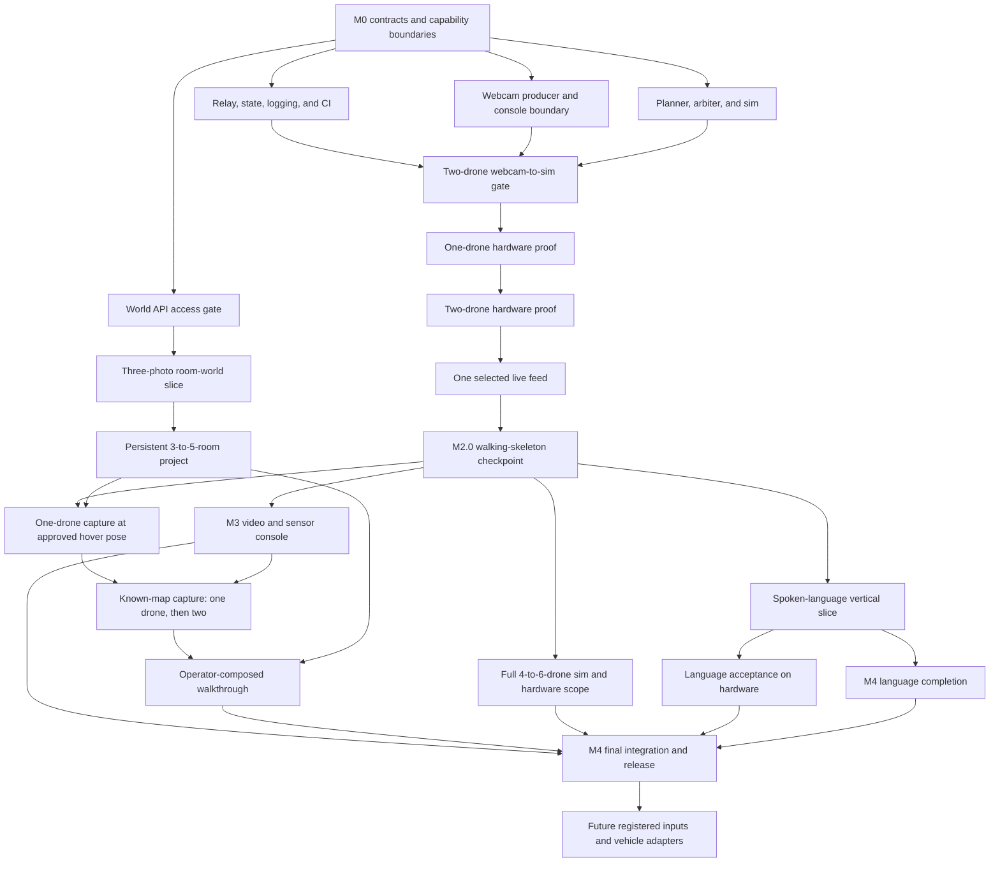

# Sweep MVP delivery plan

This plan turns the PRD into issue-ready work without creating a second delivery taxonomy. M0 through M4 are the canonical milestones. M1 first proves the human room-world loop: three guided phone photos become one private Marble room world. M2.0 remains the first flight checkpoint, where two real indoor drones complete a bounded webcam-gesture workflow through the deterministic safety path while the console shows one selected live feed. Later gates add one-drone capture, known-map room collection by one and then two drones, and an operator-composed walkthrough. The complete MVP exits M4. Hardware claims remain gated on recorded evidence.

Interaction, Autonomy, and Platform are capability areas for coordination and module boundaries. They are not assigned to people for the capstone. Any engineer may claim a ready item and owns that item through review, integration, and acceptance evidence.

Dynamic claiming has one safety exception. Changes to shared contracts or safety-critical code have one named change owner per change and require cross-review before merge. This applies to Intent v1, the adapter interface, relay state shape, the arbiter, e-stop, and safety-relevant planner paths.

## Dependency map

The room-world lane starts with contracts and one paid World API request, then proceeds to phone capture independently of flight. M2.0 keeps one control order: contracts, two-drone sim, one real drone, two real drones, then one selected live feed. Drone capture starts after that checkpoint and proves one aircraft before two. Language work and the 4-to-6-drone expansion also begin after M2.0. Koby's provisional direction to run M3 video and M4 language completion concurrently remains in place after M2.0, pending team confirmation of capacity, discussed below. The complete MVP claim waits for control, media, known-map capture, and composed-walkthrough evidence.

## Work breakdown

Each item below has enough boundary and acceptance detail to become an issue later. Dependencies refer to other item IDs in this plan.

### M0: Scope and contracts

**M0.1: Freeze the MVP boundary and capability areas**
Capability area: team. Dependencies: none.
Scope: approve the 4-to-6-drone core MVP, move the Band to Future, make spoken language the second control path, and adopt dynamic task claiming with the contract and safety exception above.
Done when: the PRD has one milestone scheme, every core deliverable has a capability area and dependency boundary, and no optional input blocks M1 through M4.

**M0.2: Draft and freeze executable contracts**
Capability area: Platform, with Interaction and Autonomy review. Dependencies: M0.1.
Scope: freeze Intent v1 including `capture_room` and `map_area`; telemetry, flight and camera adapters, pose-anchored capture-bundle, WebSocket, source-registry, repository, `building`, `room`, and `capture` contracts; draft the World API-dependent `generation_job` fields; establish the shared input conformance runner and CI skeleton. The flight interface includes acknowledged yaw control. The camera interface includes capability discovery, gimbal positioning, readiness, native panorama, component capture, media retrieval, and typed unsupported results.
Done when: webcam fixtures exercise the real validator, unknown sources and invalid payloads are rejected, planner motion semantics match the intent schema, `capture_room` requires confirmation and exactly one selected aircraft, `map_area` requires confirmation and supplied map and room-graph inputs, every non-vendor state transition has one defined owner and terminal result, and the provisional World API fields are marked for M0.3 validation.

**M0.3: Prove World API access**
Capability area: Platform. Dependencies: M0.2, paid World API account and key.
Scope: submit one real private `marble-1.1` multi-image request with three images, poll the operation, and record the upload, operation, result, asset, duration, and settled-credit shapes. Revise the provisional records to match that evidence and freeze the `generation_job` contract. The Marble web app and mocked responses provide development evidence only.
Done when: the real job reaches `done=true` and returns a world ID, `world_marble_url`, and asset metadata; the observed fields have contract fixtures; and the reviewed record schema is frozen. If API access is unavailable, M1.0 remains blocked.

### M1: Sim control MVP

**M1.0: Build the three-photo room-world vertical slice**
Capability area: Interaction with Platform integration. Dependencies: M0.3.
Scope: let a user create a building and room, capture exactly three overlapping photos from one standing area, validate and normalize the files, upload them server-side, submit a private `multi-image` request with `reconstruct_images: true`, poll asynchronously, persist provenance and actual credits, and open the returned Marble URL. Show `draft`, `uploading`, `queued`, `running`, `succeeded`, `failed`, and `timed_out` states; retry without losing the capture; allow the next room to be captured while jobs run.
Done when: M1.0 first records the calibrated blur, exposure, and overlap fixtures and thresholds; five scripted real-API captures each preserve exactly three generation-source records and one terminal job record; invalid type, dimension, aspect ratio, size, blur, exposure, and overlap cases have visible recovery; no file exceeds 20 MB; normalized files have identical dimensions and aspect ratio with at least 1024 pixels on both axes; and the World API key never reaches the browser. Before each job, three source-visible anchors are recorded. Two reviewers independently recognize the room type, entrance, and all three anchors in every accepted result.

**M1.1: Build relay state, logging, and replay**
Capability area: Platform. Dependencies: M0.2.
Scope: first establish one authenticated WebSocket session, canonical two-drone state, acknowledgements and refusals, append-only JSONL, and basic CI for M2.0. State fan-out and backend replay follow on the same contracts.
Done when: the checkpoint path authenticates the webcam and keyboard sources, logs every accepted or refused intent and acknowledgement, and reconstructs canonical state from adapter telemetry. Backend replay later reproduces the ordered intent and state history; replay UI is outside M2.0.

**M1.2: Build the deterministic autonomy and safety path**
Capability area: Autonomy. Dependencies: M0.2.
Scope: start with a two-drone sim and planner support for `arm`, `select`, `takeoff`, `translate`, `hold`, `come_home`, `land_all`, and `estop`. Keep the full Intent v1 schema and return `unsupported` for its other names during M2.0. Implement the complete arbiter checks for state, confirmation, geofence, ceiling, spacing, battery, link loss, positioning loss, and e-stop.
Done when: every checkpoint intent and planned command is checked, unsupported valid intents produce a typed refusal before planning, unsafe requests produce no adapter command, and the two-drone scenarios pass deterministically. `come_home` remains planner behavior expressed through the existing adapter methods.

**M1.3: Connect the webcam console to Intent v1**
Capability area: Interaction. Dependencies: M0.2, M1.1.
Scope: isolate the real event-to-intent boundary and remove production use of the internal simulator. For M2.0, show connection, selection, two drone states, the last acknowledgement or refusal, keyboard e-stop, and a slot for one selected live feed. Ledger, health, and replay views follow after the checkpoint.
Done when: webcam and keyboard events produce accepted Intent v1 payloads, the checkpoint state is visible, and disconnects or send failures are shown without substitute commands.

**M1.4: Pass the two-drone webcam-to-sim gate**
Capability area: team. Dependencies: M1.1, M1.2, M1.3.
Scope: run the M2.0 workflow through the production webcam, relay, planner, arbiter, and two-drone sim path: arm, select both, confirmed takeoff, translate together, hold, come home, confirmed land-all, with e-stop available throughout.
Done when: the workflow passes in simulation, a deliberate geofence violation is refused before an adapter command, e-stop reaches both simulated drones, configured link loss produces the safe behavior, CI is green, and the JSONL log explains the run.

**M1.5: Expand the sim path to the full scripted mission**
Capability area: Autonomy with Interaction and Platform integration. Dependencies: M1.4, M2.0.
Scope: add the formation, altitude, spacing, and sweep behaviors deferred by M2.0; expand the simulator and console from two drones to 4 to 6; run Appendix E through the production path.
Done when: 4 to 6 simulated drones complete Appendix E in under three minutes and the log contains zero unsafe intents.

**M1.6: Build the transcript-to-plan compiler path**
Capability area: Platform. Dependencies: M1.1, M1.2, M1.5.
Scope: use one pinned model to produce ordered Intent v1 plans from final speech transcripts and authoritative relay state; validate, log, and emit confirmed intents one at a time.
Done when: models cannot emit adapter commands, invalid plans emit nothing, and compiler input, output, validation, operator decision, and usage are replayable.

**M1.7: Capture speech and add preview, clarification, and confirmation**
Capability area: Interaction. Dependencies: M1.3, M1.6.
Scope: add one-shot push-to-talk recording to the pinned Chromium demo browser; upload recordings of at most 30 seconds to a relay endpoint; transcribe through the OpenAI Whisper API; show the final transcript; add plan preview, clarification, confirm, cancel, and explicit permission, capture, upload, timeout, rate-limit, service, and network error states. Keep `OPENAI_API_KEY` in the relay process environment.
Done when: three live spoken multi-step orders reach plan preview, no language intent emits before confirmation, transcription failures emit nothing, the browser never receives the API key, and ambiguous requests present choices or a refusal.

**M1.8: Establish the provisional language eval**
Capability area: Platform, with team-contributed cases. Dependencies: M1.6, M1.7.
Scope: create 50 reviewed transcript-to-plan cases for the scripted mission, three multi-step orders, ambiguity, confirmation-sensitive requests, and unsafe requests; add a manual 20-utterance clean-room speech smoke run across two speakers; support cached CI and an explicit live compiler refresh.
Done when: exact-match plan accuracy is at least 85%, the live speech smoke run reaches at least 85% exact transcript match, unsafe-intent count is zero, and three spoken multi-step orders pass through the complete sim path.

#### M1 room-world scope

The room-world slice uses human phone capture in an empty, static room. The guide asks for three viewing directions with visible overlap, stable lighting, and shared architectural features. Standard `marble-1.1` multi-image generation costs 1,600 API credits, currently $1.28 at $1 per 1,250 credits. A ten-room run costs $12.80 before retries. World Labs says accepted jobs usually take about five minutes, so every room is an asynchronous job. API billing and Marble web-app billing are separate. [World API pricing](https://docs.worldlabs.ai/api/pricing) · [World API rate limits](https://docs.worldlabs.ai/api/rate-limits)

The output is an AI-generated room world. It carries no claim about hidden geometry, measurements, inventory, or safety. Generated worlds are private by default. The team must decide source-photo, vendor-asset, and project-record retention and deletion before implementation. People and pets remain outside the M1 capture set.

#### M1 speech scope

**The M1 speech scope is bounded on purpose.** Whisper API capture and transcription sit on top of the reviewed transcript-to-plan slice and add browser recording, relay upload, server-side key handling, transcription and cost logging, error states, a manual smoke run, compiler integration, and preview and confirmation.

That scope holds for one-shot push-to-talk in the pinned Chromium browser, `en-US`, a working microphone and network, recordings capped at 30 seconds, and the `whisper-1` transcription endpoint. The final transcript enters the same compiler path that typed fixtures exercise. M4 owns offline transcription, continuous listening, multilingual support, and noisy-room hardening.

The Whisper path needs browser recording plus a relay endpoint because the API accepts an audio-file upload and the API key must stay off the client. OpenAI prices `whisper-1` transcription at [$0.006 per minute](https://developers.openai.com/api/docs/models/whisper-1). A 30-second command therefore contributes at most $0.003 to the $0.05 combined transcription-plus-compiler budget. The relay logs audio duration, transcription cost, compiler cost, and the combined total for every command. OpenAI's [API key safety guidance](https://help.openai.com/en/articles/5112595-best-practices-for-api-key-safet) requires requests from browser clients to pass through a server that holds the key.

The 50 reviewed cases test transcript-to-plan behavior in CI. Microphone recognition evidence comes from the separate 20-utterance, two-speaker live run through the real browser capture path. Synthetic transcripts cannot satisfy speech acceptance.

### M2: Hardware control MVP

**M2.0: Pass the two-drone walking-skeleton checkpoint**
M2.0 is the first exit gate across M1.1 through M1.4, M2.1 and M2.2, and the selected-feed slice of M3.1. It remains within the M0 through M4 milestone series.

The checkpoint supports the eight existing Intent v1 names `arm`, `select`, `takeoff`, `translate`, `hold`, `come_home`, `land_all`, and `estop`. Every other valid Intent v1 name returns `unsupported`; unknown names and invalid arguments keep their existing validation refusals. The workflow is:

1. Arm.
2. Select both drones.
3. Take off after confirmation.
4. Translate both together.
5. Hold.
6. Come home.
7. Land both after confirmation.
8. E-stop at any point.

The one-drone proof selects the only connected drone and runs the same sequence and safety checks. The two-drone proof then replaces that selection with both connected drones and verifies coordinated translation and spacing.

The checkpoint keeps the arbiter, e-stop, state and confirmation checks, geofence, ceiling, spacing, battery, link-loss and positioning-loss behavior, append-only JSONL audit log, and the two-person hardware rule. The formation library, altitude gesture, sweep planner, detector, mosaic, language and LLM work, replay UI, metrics dashboard, session report, and release polish start after this gate.

M2.0 passes when:

- the complete workflow passes in the two-drone simulator;
- one real drone passes before the second is added;
- two real drones complete the workflow without manual flight correction;
- a deliberate geofence violation is refused before an adapter command is sent;
- e-stop reaches both drones and link loss produces the configured safe behavior;
- the selected live video feed stays visible; and
- the JSONL log explains accepted commands, refusals, acknowledgements, state changes, and safety actions.

**M2.1: Select and prove the hardware adapter**
Capability area: Autonomy. Dependencies: M1.4, delivered hardware, positioning, and a guarded flight space.
Scope: inventory the drones, choose the adapter, calibrate positioning, verify ground telemetry, and run the M2.0 workflow on one real drone with a two-person crew.
Done when: the selected adapter reports stable telemetry and one real drone completes the workflow with the expected refusals and safety behavior.

**M2.2: Prove two-drone hardware control**
Capability area: Autonomy, with bounded Interaction and Platform support. Dependencies: M1.4, M2.1.
Scope: add the second drone and run the eight-intent M2.0 workflow. Exercise spacing, geofence refusal, battery behavior, link and positioning loss, and e-stop without adding the deferred feature set.
Done when: two real drones complete the workflow without manual correction, every deliberate unsafe request produces the expected refusal, and the JSONL evidence explains the run.

**M2.3: Add hardware watchdog and session evidence**
Capability area: Platform. Dependencies: M1.1, M2.0.
Scope: add operator-presence enforcement, extended hardware log capture, and end-of-session reports. These are polished-MVP work after the checkpoint.
Done when: stale operator presence triggers the configured safe behavior and the report contains commands, refusals, telemetry, and timing.

**M2.4: Complete staged flight acceptance**
Capability area: Autonomy, with bounded Interaction and Platform support. Dependencies: M1.5, M2.2, M2.3.
Scope: expand from the accepted two-drone checkpoint to three, then 4 to 6; add altitude, formation, and sweep to the accepted checkpoint behaviors.
Done when: 4 to 6 drones pass Appendix E five consecutive times and every deliberate unsafe request produces the expected refusal.

**M2.5: Repeat language acceptance on hardware**
Capability area: team. Dependencies: M1.8, M2.4.
Scope: run the three M1 multi-step language orders through the hardware adapter.
Done when: plans, commands, refusals, and operator decisions match the sim acceptance within hardware tolerances.

**M2.6: Build the room-by-room project**
Capability area: Interaction with Platform integration. Dependencies: M1.0.
Scope: let the user name and capture 3 to 5 rooms in any order, see each job state, retry a room, open every successful room world, record both sides of doorways, and store explicit room adjacency plus an optional floor-plan reference. Store doorway and floor-plan evidence as composition references, separate from the exactly three generation inputs, so rooms with several exits remain representable.
Done when: one scripted project continues capturing while prior jobs run, survives reload, exposes each room's three generation sources, any composition references, and Marble world, and has no orphaned or cross-linked room, capture, or job IDs.

**M2.7: Prove one-drone room capture**
Capability area: Autonomy with Platform and Interaction integration. Dependencies: M0.2, M2.0, M2.6, one supported camera and Android controller.
Scope: build a small Android DJI Mobile SDK capture bridge and prove its relay boundary; do not route Mobile SDK calls through the Python, ROS 2, or MAVLink adapters. The bridge reads runtime panorama and photo capabilities, triggers the planner-selected operation, downloads the resulting panorama or component frames, and returns file acknowledgements for capture association. Then execute a confirmed `capture_room` with one aircraft hovering at an operator-approved pose. Require good link and positioning, enough battery and storage, no active motion mission, and a live e-stop. Prefer a native stitched equirectangular panorama when the bridge returns one; otherwise collect up to eight overlapping pose-anchored frames. The planner owns every yaw, gimbal, settle, camera-ready, capture, and file-created step.
Done when: the relay reaches the bridge on one recorded aircraft, controller, camera, firmware, and Mobile SDK combination; the runtime probe reports the tested capabilities; and one real aircraft produces a complete capture bundle for the correct room. Every file records capture ID, pose, yaw, gimbal pitch, intrinsics, timestamp, and file ID. The exact supported input shape, either one valid equirectangular panorama or up to eight reconstruction frames, completes a real private World API job and returns the linked room world before that capture mode is accepted. Injected stale telemetry, timeout, camera error, unexpected translation, link loss, and position loss all command hold and leave visible failure evidence. Unsupported panorama capability returns a typed result instead of an assumed camera sequence.

#### Drone capture geometry

The component-frame pattern derives yaw spacing from `yaw_step <= horizontal_fov * (1 - overlap_fraction)`. Forty percent overlap is the first experiment. An 82-degree horizontal field of view yields about 49 degrees, so the first test uses eight headings at 45-degree increments. A level yaw ring leaves floor and ceiling unseen. Only a valid camera-produced equirectangular artifact is called a panorama; true spherical coverage otherwise needs multiple pitch rows. Three phone photos remain the sparse human onboarding flow rather than the drone's full-coverage pattern. [DJI Mobile SDK version differences](https://developer.dji.com/doc/mobile-sdk-tutorial/en/quick-start/version-differences.html) · [DJI panorama tutorial](https://developer.dji.com/mobile-sdk/documentation/ios-tutorials/PanoDemo.html)

### M3: Video, sensor, and known-map capture

**M3.1: Establish media ingest and recording**
Capability area: Platform with Interaction integration. Dependencies: M1.1 and one camera source. The M2.0 slice also depends on M2.2.
Scope: first keep one selected live feed visible through the M2.0 run. After the checkpoint, configure MediaMTX ingest, WebRTC and MJPEG serving, recording, stream naming, and latency measurement.
Done when: M2.0 can display the selected feed throughout its run. Full M3.1 exits when one source also streams and records reliably within the latency budget; 4-to-6-source claims remain blocked until hardware evidence exists.

**M3.2: Build the camera and sensor dashboard**
Capability area: Interaction. Dependencies: M1.3, M3.1.
Scope: add the live mosaic, focus pane, focus-by-selection, telemetry and sensor state, attention state, and clear degraded-source status.
Done when: the operator can select a drone, inspect its live camera and sensor state, and see stream or telemetry failures without affecting flight control.

**M3.3: Add detection events and operator confirmation**
Capability area: Interaction with Platform integration. Dependencies: M3.1, M3.2.
Scope: sample frames, run the detector, emit timestamped detection events, promote attention, and require operator confirmation before detections affect swarm behavior.
Done when: a qualifying detection promotes the selected feed within one second, all events are logged, and no detection emits a command.

**M3.4: Prove known-map multi-room capture**
Capability area: Autonomy with Platform and Interaction integration. Dependencies: M2.7, M3.1, a supplied occupancy map and approved room poses.
Scope: start from an operator-console or language preview of `map_area {area_id}` and one explicit batch confirmation. Freeze the selected aircraft, map version, room assignments, approved poses, routes, and capture patterns into that authorization. Execute it through one drone in a fixed 3-to-5-room, single-floor test area, then let two selected drones partition the same known targets, maintain separation, collect complete bundles, and return home. The planner resolves the supplied occupancy map, room graph, and approved capture poses into collision-checked routes and internal room-capture tasks. Each route segment and capture is revalidated immediately before dispatch; a changed selection or plan invalidates confirmation, while stale or unsafe state fails closed to hold or the configured fail-safe. Use open doors, a static empty area, no stairs, no people or pets, guarded aircraft, a known launch and return zone, an operator present, and an independent e-stop. Marble receives media only after the flight path has completed its conventional safety checks.
Done when: one-drone evidence passes before the two-drone trial, then the two-drone workflow passes five consecutive runs without manual flight correction. Every reachable room receives one complete pose-anchored bundle; no planned path crosses an occupied cell or minimum-clearance boundary; no separation violation occurs; every aircraft returns or executes its configured fail-safe; and the room catalog has no missing, duplicate, or cross-linked captures. Capture bundles from the final accepted run complete private per-room World API jobs, and every returned room world links to the same building, room, capture, and generation records.

**M3.5: Earn the control and media exit**
Capability area: team. Dependencies: M2.5, M3.2, M3.3, M3.4.
Scope: demonstrate webcam or spoken-language control with the camera, telemetry, sensor console, and known-map room-capture path active.
Done when: the complete operator workflow succeeds on 4 to 6 drones, known-map capture succeeds on the accepted two-drone configuration, and the session evidence supports every control, safety, video, sensor, and capture claim.

### M4: Language completion and final proof of concept

**M4.1: Complete deterministic language resolution**
Capability area: Autonomy. Dependencies: M1.8 and stable relay state.
Scope: implement bounded selection and location resolution with explicit ambiguity and refusal results.
Done when: resolver tests cover IDs, current selection, supported relative phrases, stale state, ambiguity, and unresolved locations without bypassing the planner.

**M4.2: Complete language evaluation and fallback**
Capability area: Platform, with team-contributed cases. Dependencies: M1.8. Resolver-dependent cases also depend on M4.1.
Scope: expand to the responder-reviewed 200-item set, complete cached and live eval paths, add the local compiler fallback, and close compiler failure cases. Corpus authoring, cached fixtures, and non-resolver cases proceed beside M4.1; resolver cases join after its result contract freezes.
Done when: exact-match accuracy remains at least 85%, unsafe-intent count is zero, cached fixtures are produced by real compiler runs, and fallback uses the same validation path.

**M4.3: Harden speech UX and evaluate offline transcription**
Capability area: Interaction with Platform support. Dependencies: M1.7.
Scope: evaluate noisy-room speech, retries, timeouts, and a local transcription fallback if offline evidence requires it; polish transcript, preview, clarification, confirmation, and refusal behavior.
Done when: the primary Whisper API path and any approved local fallback feed the same transcript-to-plan path and cannot bypass preview, confirmation, planner, or arbiter checks.

**M4.4: Harden, document, and release**
Capability area: team. Dependencies: M2.6, M3.5, M4.2, M4.3.
Scope: add the room worlds generated from M3.4's final accepted drone run to Marble Studio Compose, manually place, rotate, and scale them against room adjacency and the floor-plan reference, align floors and doorways, review each transition, create a camera path in Studio Record, download the MP4 before leaving the page, and upload it to the same building project. Preserve and label captured, generated, composed, and enhanced artifacts. Polish provenance, deletion, cost, latency, failure handling, operator docs, the demo reel, and release.
Done when: the confirmed “Map this floor” chain is traceable from its source through `map_area`, the accepted capture bundles and private World API jobs to a 3-to-5-room composition; every doorway transition is reviewed; and the stored MP4 visits each room once. All claimed control and capture exits have recorded evidence, CI is green, and the tagged v0.1 release is reproducible from the guide. Record paths and enhanced video are downloaded during the Studio session because World Labs says they do not persist after leaving the page.

### Future

**F.1: Add optional input sources**
Capability area: Interaction with Platform registration support. Dependencies: M4.4 and a concrete source with host access.
Scope: add an EMG band through a source-specific producer, registry entry, and shared conformance runner.
Done when: real source events pass Intent v1 conformance and the production safety path without relay, planner, arbiter, or adapter redesign.

**F.2: Extend vehicle portability**
Capability area: Autonomy with Platform eval support. Dependencies: working M2 evidence and the capability/action eval harness.
Scope: evolve capability contracts and add one evidence-backed vehicle adapter at a time.
Done when: unsupported behavior returns a typed refusal and no input or model calls an adapter directly.

**F.3: Automate spatial capture and exploration**
Capability area: Autonomy with Platform and Interaction integration. Dependencies: M3.4, a conventional mapping stack, and measured accuracy gates.
Scope: evaluate automatic room registration, a branded multi-room Spark renderer, metric alignment through SLAM, photogrammetry, or LiDAR, time-indexed rescans, Atlas integration, and autonomous exploration of an initially unmapped area. Onboard VIO plus depth or LiDAR must produce the occupancy map used by the planner. Marble remains a downstream presentation layer.
Done when: each capability has its own measured geometry, localization, coverage, and safety acceptance. Generated Marble content never supplies occupancy, clearance, geofence, collision, or position truth.

## Concurrent M3 and M4 lanes

**Provisional decision: run the M3 video lane and the M4 language lane concurrently after M2.0, pending team confirmation that capacity covers both.** The two feature sets have no hard sequential dependency on each other once M2.0 establishes the relay, authoritative state, Intent v1, safety path, two-drone hardware proof, and selected-feed shell. Dynamic claiming creates more scheduling options, but it does not reduce the total work or remove shared-file and review gates.

| Work package | Parallelization boundary |
|---|---|
| Full language compiler, state context, validation, logging, ordered emission, and eval plumbing | Plan schema, relay state shape, and ordered emission use one change owner and cross-review. |
| Whisper API capture, language UI, full resolvers, corpus completion, offline evaluation, and speech hardening | Corpus writing and the live speech smoke run can fan out. Resolver and UI integration wait on frozen result envelopes. |
| Media ingest, recording, stream naming, detection-event transport, and latency measurement | Media configuration can proceed independently. Detection and relay-state changes use one change owner and cross-review. |
| Mosaic, focus, sensor state, detector, attention promotion, and confirmation | Detector experiments can run independently. Console integration overlaps the language UI files. |
| Phone room capture, World API jobs, room catalog, and Studio composition | Human capture can proceed after the M0 API gate. Shared console and persistence changes merge through one owner. Studio composition stays operator-assisted. |
| Drone capture and known-map traversal | Begins after M2.0, capability-probes the selected camera, and proves one aircraft before two. Every safety-relevant planner or adapter change receives cross-review. |
| Cross-stack review, end-to-end acceptance, and defect margin | Safety-path and shared-contract reviews cannot be self-approved or merged concurrently. |

After M2.0, the freely parallelizable pieces are MediaMTX recording and multi-stream setup, detector prototyping, human room-project UX, corpus authoring, and compiler evaluation fixtures after their input contracts freeze. Safety- or contract-gated pieces are Intent v1 and plan-schema changes, relay state and detection-event shapes, camera capability and capture-bundle contracts, `validate_plan` and ordered emission, arbiter or e-stop changes, and safety-relevant planner work. Each gated change has one named change owner and a different reviewer.

The order after M2.0:

1. Freeze the transcription request/response, plan result, detection-event, and stream-naming contracts. Each contract has one change owner and a different reviewer.
2. Complete M1 Whisper capture and compiler integration. In parallel, claim the room project, MediaMTX recording and multi-stream work, detector prototyping, corpus authoring, cached eval fixtures, and speech smoke preparation.
3. Prove one-drone room capture after the base hardware checkpoint. Then integrate known-map capture beside the M3 mosaic, sensor, and detection path.
4. Integrate M4 resolvers, the 200-item eval, local compiler fallback, speech hardening, and the operator-composed walkthrough. Shared console changes merge through one owner at a time.
5. Continue delivery-gated M2 work in booked blocks. Hardware work reduces the capacity available to the concurrent lanes.
6. Before the lanes start, the team confirms it has the capacity for both or drops the concurrency.

This preserves Koby's concurrent direction. It is provisional until the team confirms capacity.
