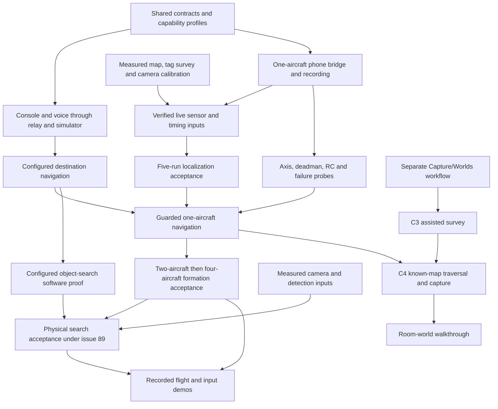

# Sweep MVP delivery plan

Updated September 6, 2026. The [GitHub issues](https://github.com/worldofhacks/sweep/issues) define feature scope and acceptance. This plan maps that work to the existing M0–M4 milestones and C1–C4 capability releases. Historical milestone IDs remain stable; an older paragraph does not override a later issue decision.

The current implementation priority is destination navigation and object search through the console, voice compiler, relay, planner, arbiter and phone bridge. Capture/Worlds continues as a separate team-owned workflow. Its API jobs and presentation work do not gate the navigation or search software demo. Physical flight remains gated by measured inputs, localization, clearance, bridge probes and operator/RC acceptance.

The integrated PR stack has passed 2,201 Python tests, 528 console tests, a production console build, and fleet/navigation/search browser rehearsals. [The runtime audit](https://github.com/worldofhacks/sweep/pull/224) records the boundaries and repair PRs. These are software results on an integration checkout. Open PRs still require review and merge; no physical acceptance is implied.

## Current issue map

| Work | Authority | Current boundary |
| --- | --- | --- |
| Basic controls and fleet operations | [#97](https://github.com/worldofhacks/sweep/issues/97), [#98](https://github.com/worldofhacks/sweep/issues/98) | C1 includes selected land and earned altitude behavior. C2 adds disarm, formations, spacing and sweep. Simulated C2 has software coverage; the Mini 3 binding stays at C1 until its hardware gate passes. |
| Destination navigation | [#143](https://github.com/worldofhacks/sweep/issues/143), [#144](https://github.com/worldofhacks/sweep/issues/144), [#145](https://github.com/worldofhacks/sweep/issues/145) | Configured `navigate {zone_id}` previews and executes an exact route for selected airborne aircraft, then holds. It neither takes off implicitly nor starts capture. |
| Object search | [#89](https://github.com/worldofhacks/sweep/issues/89), [#62](https://github.com/worldofhacks/sweep/issues/62) | Configured `search {zone_id, target_label}` has a repeated browser proof with synthetic sources. Real detection/localization evidence remains open. #89 retains its formal M3E stretch and hardware dependencies; its software implementation is a current priority. |
| Map, inputs and localization | [#82](https://github.com/worldofhacks/sweep/issues/82), [#84](https://github.com/worldofhacks/sweep/issues/84), [#86](https://github.com/worldofhacks/sweep/issues/86) | Physical mapping, source measurements and five independent-reference route rehearsals remain required. Recording, publisher, gate and acceptance-tool readiness must be checked separately. |
| Formation volumes | [#82](https://github.com/worldofhacks/sweep/issues/82), [#87](https://github.com/worldofhacks/sweep/issues/87), [#88](https://github.com/worldofhacks/sweep/issues/88) | Lobby and atrium-front are candidates pending measured approval. Kitchen remains a named destination/transit area and is not a formation fallback. |
| Assisted survey and known-map capture | [#99](https://github.com/worldofhacks/sweep/issues/99), [#100](https://github.com/worldofhacks/sweep/issues/100), [#25](https://github.com/worldofhacks/sweep/issues/25), [#63](https://github.com/worldofhacks/sweep/issues/63) | Separate Capture/Worlds lane. C3 `survey_area` grants no autonomous motion; C4 `map_area` requires the accepted traversal-and-capture workflow. Navigation alone does not enable either release. |

The MVP targets a live technical demonstration. Production governance and operations remain in F.6. The five-route localization requirement stays in M3B and is not deferred to production hardening.

Interaction, Autonomy, and Platform define coordination and module boundaries. Any engineer may claim a ready item and own it through review, integration, and acceptance evidence.

Dynamic claiming has one safety exception. Changes to shared contracts or safety-critical code have one named change owner per change and require cross-review before merge. This applies to Intent v1, the adapter interface, relay state shape, the arbiter, e-stop, and safety-relevant planner paths.

## Other tracked engineering work

| Issue | Planned effect and gate |
| --- | --- |
| [#91](https://github.com/worldofhacks/sweep/issues/91) | BVC velocity filtering remains open. The issue requests it before M3C and requires it before M3D; current refusal/separation checks do not claim that filter is implemented. |
| [#92](https://github.com/worldofhacks/sweep/issues/92) | A dynamics simulator supplements the kinematic proof; its modeled dynamics do not replace physical calibration. |
| [#93](https://github.com/worldofhacks/sweep/issues/93) | MCAP/Foxglove evidence review is tracked separately from the runtime audit log. |
| [#94](https://github.com/worldofhacks/sweep/issues/94), [#95](https://github.com/worldofhacks/sweep/issues/95) | Frame/timing/acknowledgement contracts and language policy/replan/evaluation follow-ups remain explicit issue work; completed slices do not close the whole issue automatically. |
| [#96](https://github.com/worldofhacks/sweep/issues/96), [#115](https://github.com/worldofhacks/sweep/issues/115), [#124](https://github.com/worldofhacks/sweep/issues/124) | Detector dependency decision, optional formation routines, and speech provider integration retain their own acceptance and sequencing. |

## Dependency map

## Work breakdown

The items below retain the milestone vocabulary used by existing issues. Use the current issue body and recorded owner decisions for scope, dependencies and acceptance; issue closure and PR merge state must be checked before declaring a gate complete.

Subtask IDs are stable historical identifiers referenced by existing issues. Removed or moved work leaves deliberate gaps.

### M0: Scope and contracts

**M0.1: Freeze the MVP boundary and capability areas**
Capability area: team. Dependencies: none.
Scope: approve the four DJI Mini 3 and RC-N1 sets on hand, paired with four Android bridge nodes, as the physical core MVP; retain 4 to 6 drones in simulation; make console buttons the reference producer for early intent-to-action testing while webcam gesture work proceeds against the same contracts; build the transcript-to-plan compiler against two-drone sim and relay state; keep speech capture and compilation in the current input lane, with producer acceptance separate from hardware capture; move the Band to Future; and adopt dynamic task claiming with the contract and safety exception above.
Done when: the PRD has one milestone scheme, every core deliverable has a capability area and dependency boundary, and no optional input blocks M1 through M4.

**M0.2: Draft and freeze executable contracts**
Capability area: Platform, with Interaction and Autonomy review. Dependencies: M0.1.
Scope: freeze Intent v1 including `intent_id`, retry correlation, `capture_room`, `survey_area`, `map_area`, and the configured `navigate`/`search` extensions; telemetry, flight and camera adapters, live fleet membership, pose-anchored capture-bundle, WebSocket, source-registry, repository, `building`, `room`, and `capture` contracts; draft the World API-dependent `generation_job` fields; establish the shared input conformance runner and CI skeleton. The flight interface includes acknowledged yaw control. The camera interface includes capability discovery, gimbal positioning, readiness, native panorama, component capture, media retrieval, and typed unsupported results.
Done when: console-button fixtures exercise the real validator, unknown sources and invalid payloads are rejected, `intent_id` persists from draft through terminal state, a retry creates a new identifier linked to the failed request, planner motion semantics match the intent schema, `capture_room` requires confirmation and exactly one selected aircraft, `survey_area` authorizes recording and annotation but no autonomous motion, `map_area` requires confirmation and supplied map and room-graph inputs, every non-vendor state transition has one defined owner and terminal result, and the provisional World API fields are marked for M0.3 validation.

**M0.3: Prove a real World API job**
Capability area: Platform. Dependencies: M0.2, paid World API account and key.
Scope: submit one real `marble-1.1` multi-image request with three images and explicitly set `public: false`. Poll the operation and record the observed upload, operation, result, asset, and duration shapes. Revise the provisional records to match that evidence and freeze the `generation_job` contract. The Marble web app and mocked responses provide development evidence only.
Done when: the real job reaches `done=true` and returns a world ID, `world_marble_url`, and asset metadata; the observed fields have contract fixtures; and the reviewed record schema is frozen. If API access is unavailable, the M1 exit remains blocked.

#### Input channel coverage policy

Every current and future input channel targets full Intent v1 coverage over time. Coverage ships per channel and intent pair after measured accuracy for that pair clears a risk-scaled threshold. Lower-risk intents such as `select` and `capture_room` may qualify earlier. Safety-critical intents such as `estop`, `arm`, `takeoff`, and any intent that moves real hardware require a substantially higher threshold and may require redundant confirmation after they qualify. The numerical thresholds and redundant-confirmation rules are open owner decisions that must be frozen before accepting each pair. Console controls and the physical RC remain the trusted fallback for every safety-critical action.

Channels with a small realistic input space should approach full coverage sooner. A bounded gesture classifier can expand toward nearly every intent as its classes qualify. Voice has a much larger phrase space, so each voice and intent pair qualifies independently. Future channels, including the EMG band, follow the same policy and cannot remain permanently limited to an initial subset.

### M1: One-drone room-world vertical slice

#### Completed precursor: manual three-photo capture

Three guided phone photos have created one Marble room world. Preserve the photos, output, and observed quality as fallback evidence.

**M1.1: Build relay state, logging, and replay**
Capability area: Platform. Dependencies: M0.2.
Scope: first establish one authenticated WebSocket session and a live aircraft registry keyed by stable `drone_id`. The registry carries a monotonic `roster_version`, a connection epoch per aircraft, and `registered`, `ready`, `leaving`, `disconnected`, or `degraded` state. Signed join, readiness, graceful-leave, and unexpected-loss events update the registry. Up to four physical aircraft may register, disconnect, and rejoin without restarting the session. A joined node becomes selectable after identity, adapter capabilities, telemetry freshness, home pose, control authority, and RC-safety-operator presence pass. State fan-out, append-only JSONL, and backend replay use the same contract.
Done when: the checkpoint path authenticates the console and keyboard sources, logs every accepted or refused intent, acknowledgement, membership event, roster version, and connection epoch, derives canonical state and selection from current adapter telemetry, and preserves the history of disconnected aircraft. Join leaves current selection and accepted plan unchanged; the next dispatch applies roster-version validation. Reconnection increments the aircraft's connection epoch. Backend replay later reproduces the ordered intent, membership, and state history; replay UI is outside M2.0.

**M1.2: Build the deterministic autonomy and safety path**
Capability area: Autonomy. Dependencies: M0.2.
Scope: start with a two-drone flight sim and planner support for `arm`, `select`, `takeoff`, `translate`, `hold`, `come_home`, `land`, `land_all`, and `estop`. Represent the fleet as a collection keyed by registered aircraft ID; planner expansion, arbiter checks, and adapter dispatch iterate the selected registered aircraft. Acceptance fixtures select the exercised count. Every accepted plan records `roster_version`, and dispatch refuses a stale version. Joining preserves current selection and accepted plans. Graceful removal requires the aircraft to be landed, disarmed, and free of active tasks. Removal atomically clears that aircraft from selection and invalidates pending confirmations or plans built against the prior roster. Commands and acknowledgements carry the connection epoch; a prior epoch is refused. Unexpected or airborne loss takes the configured hold or fail-safe path, remains visible in state, and preserves physical RC authority. Spacing checks cover every ready airborne aircraft, including aircraft outside the command selection. Add a concrete simulated camera implementation with deterministic full-equirectangular and eight-frame fixtures plus injected unsupported-capability, camera, and download failures. Keep the full Intent v1 schema; preserve the M1-approved `capture_room` path during M2.0 and return `unsupported` for the remaining unearned names. Implement the complete arbiter checks for state, confirmation, geofence, ceiling, spacing, battery, link loss, positioning loss, and e-stop.
Done when: every checkpoint intent and planned command is checked, unsupported valid intents produce a typed refusal before planning, unsafe requests produce no adapter command, the camera protocol runs against the simulated implementation, and the two-drone scenarios pass deterministically. The conformance and scenario suite exercises registry sizes of 1, 2, 3, and 4 plus join, ready, graceful leave, unexpected loss, and rejoin. It also proves stale-roster dispatch refusal, prior-epoch command and acknowledgement rejection, plan invalidation, and spacing checks against unselected airborne aircraft. Adding a simulated or DJI node changes configuration and credentials while the schema and control flow stay stable. Camera fixtures prove `pano_360` and `reconstruct_8` result typing and failure handling before hardware. `come_home` remains planner behavior expressed through the existing adapter methods.

**M1.3: Connect button controls to Intent v1**
Capability area: Interaction. Dependencies: M0.2, M1.1.
Scope: isolate the real event-to-intent boundary and remove production use of the internal simulator. Build the flight-control module with a live aircraft registry and selector, readiness reasons, hold/stop controls, route/search preview, confirmation and cancellation. The separate Capture/Worlds interface owns capture-library and room-world presentation; any enabled capture intent still uses the shared validated boundary. For M2.0, show membership state, connection epoch, readiness or loss reason, selection, two active drone states, the last acknowledgement or refusal, keyboard network stop, and a slot for one selected live feed. Preserve departed nodes in session history. Ledger, health, and replay views follow after the checkpoint.
Done when: console-button and keyboard events produce accepted Intent v1 payloads; each request retains one `intent_id` and timestamps through draft, pending confirmation, sent, accepted or refused, executing, and completed or failed; every refusal or failure reason is visible; retries receive a new `intent_id` linked to the failed request; join, readiness, leave, unexpected loss, and rejoin update the registry and selector without reloading; stale selections and invalidated plans are cleared visibly; the checkpoint state is visible; and disconnects or send failures are shown without substitute commands or silent retry.

**M1.4: Pass the two-drone button-to-sim gate**
Capability area: team. Dependencies: M1.1, M1.2, M1.3.
Scope: run the M2.0 workflow through the production button controls, relay, planner, arbiter, and two-drone sim path: arm, select both, confirmed takeoff, translate together, hold, come home, confirmed land-all, with the network stop available throughout.
Done when: the workflow passes in simulation, a deliberate geofence violation is refused before an adapter command, e-stop reaches both simulated drones, configured link loss produces the safe behavior, CI is green, and the JSONL log explains the run.

**M1.5: Expand the sim path to the full scripted mission**
Capability area: Autonomy with Interaction and Platform integration. Dependencies: M1.4, M2.0.
Scope: add the formation, altitude, spacing, and sweep behaviors deferred by M2.0; the formation library carries the four MVP shapes — line, column, wedge, and diamond — with sequential, non-crossing transitions; expand the simulator and console from two drones to 4 to 6; run Appendix E through the production path.
Done when: 4 to 6 simulated drones complete Appendix E in under three minutes and the log contains zero unsafe intents.

**M1.9: Prove one DJI Mini 3 bridge node**
Capability area: Autonomy with Platform support. Dependencies: M0.2, M1.1, M1.2, delivered Mini 3, RC-N1, and candidate Android phone.
Scope: pin and record the exact Mini 3, RC-N1, Android model, aircraft/controller firmware, and Mobile SDK release. Build the smallest DJI-specific authenticated pilot app and bridge; do not introduce a generic edge-agent or protobuf layer. Render the DJI feed locally with `visual_advisory` coverage, quality, and readiness overlays. Prove SDK registration and connection, Virtual Stick, required telemetry fields and measured rate, runtime camera capabilities, photo and panorama behavior, media download, live-video extraction, and disconnect/watchdog behavior. Stream Virtual Stick commands at a tested rate within DJI's documented 5-to-25 Hz range. Reject out-of-order commands and commands older than the frozen local TTL at the bridge.
Done when: one node completes a sustained 15-minute bench and guarded-hover run while recording command RTT, jitter, drops, telemetry rate, end-to-end video latency and dropped frames, phone thermals, throttling, and battery draw. WebRTC glass-to-glass p95 remains below 300 ms; the report breaks out aircraft-to-controller, Android processing, and LAN delivery. The phone sustains control, telemetry, live decode and LAN relay together. Physical RC pause, takeover, RTH, and landing remain available after laptop, LAN, relay, or bridge failure. Camera evidence reports what this exact combination returns; a panorama symbol alone does not accept `pano_360`. [DJI Mobile SDK release notes](https://developer.dji.com/doc/mobile-sdk-tutorial/en/?pbc=D3IDBfR5&pm=custom) · [DJI Virtual Stick](https://developer.dji.com/doc/mobile-sdk-tutorial/en/tutorials/virtual-stick.html) · [Mini 3 specifications](https://www.dji.com/mini-3/specs)

**M1.E: Earn the one-drone room-world exit**
Capability area: team. Dependencies: M0.3, M1.1, M1.2, M1.3, M1.9.
Scope: let the operator create a room, have the RC safety operator pilot one connected Mini 3 to an approved hover pose, click Capture room, review the generated `capture_room`, and confirm it. The button emits the same Intent v1 envelope later sources use. The planner and arbiter dispatch only to the proven bridge. M1 permits capture yaw and gimbal actions while the pilot owns translation. The drone holds the approved pose, collects `pano_360` if verified or a separately confirmed `reconstruct_8`, downloads pose-anchored media, and starts one Marble job with `public: false`. Show asynchronous states and retry while preserving the capture.
Done when: the complete button request reaches a visible room world with matching room, capture, operation, world, asset, model, and timestamp records. Before confirmation, a `capture_readiness` guidance event reports pose, pilot-approved clearance, camera, storage, image quality, and coverage readiness plus a yaw or gimbal suggestion. The Android app shows local FPV, the coverage compass, readiness gates, and capture progress. The persistent laptop shell exposes Control, Live view, Capture library, World Builder, Connectivity, and Configuration modules at their M1 depth. `pano_360` accepts only a full equirectangular artifact; `reconstruct_8` remains labeled as incomplete vertical coverage. Injected invalid intent, stale command, telemetry, camera, download, link, bridge, and World API failures take the documented refusal, hold, or recovery path. The physical RC safety operator can pause, take over, return, or land throughout.

#### Drone capture geometry

The selected camera mode must have a measured horizontal field of view that satisfies the tested overlap target. A level yaw ring leaves floor and ceiling unseen and is labeled as incomplete vertical coverage. The `pano_360` pattern succeeds only with a valid full equirectangular artifact from the camera or a verified multi-row stitcher; otherwise it returns `unsupported`. The derivation and vendor evidence live in [DJI Mini 3 capture guidance](../RESEARCH/DJI_MINI_3_CAPTURE_GUIDANCE_DISPLAY_2026_09_02.md).

#### M1 room-world scope

The pending room-world slice uses Mini 3 capture in an empty, static room. World Labs says accepted jobs usually take about five minutes, so every room is an asynchronous job.

The output is an AI-generated room world. It carries no claim about hidden geometry, measurements, inventory, or safety. Every demo request sets `public: false` and uses disposable data from an empty staged room. People and pets remain outside the M1 capture set. Production access governance and retention policy move to post-demo hardening.

#### Follow-on speech scope

**The follow-on speech scope is bounded on purpose.** Whisper API capture and transcription sit on top of the accepted button-driven intent path and the reviewed transcript-to-plan slice. They add browser recording, relay upload, server-side key handling, error states, a manual smoke run, compiler integration, and preview and confirmation.

That scope holds for one-shot push-to-talk in the pinned Chromium browser, `en-US`, a working microphone and network, recordings capped at 30 seconds, and the `whisper-1` transcription endpoint. The final transcript enters the same compiler path that typed fixtures exercise. The compiler starts against authoritative two-drone sim and relay state as soon as the M1.1 and M1.2 interfaces stabilize; M1.5, M2.0, and real hardware sit outside its readiness gate. It targets the full Intent v1 vocabulary over time and enables each voice and intent pair only under the input channel coverage policy above. M4 owns offline transcription, multilingual support, and noisy-room hardening.

The Whisper path needs browser recording plus a relay endpoint because the API accepts an audio-file upload and the API key must stay off the client. OpenAI's [API key safety guidance](https://help.openai.com/en/articles/5112595-best-practices-for-api-key-safet) requires requests from browser clients to pass through a server that holds the key.

The 50 reviewed cases test transcript-to-plan behavior in CI. Microphone recognition evidence comes from the separate 20-utterance, two-speaker live run through the real browser capture path. Synthetic transcripts cannot satisfy speech acceptance.

### M2: Hardware control MVP

**M2.0: Pass the two-drone walking-skeleton checkpoint**
M2.0 is the next control checkpoint after the M1 one-drone room-world exit. It spans M1.1 through M1.4, M2.1 and M2.2, and the selected-feed slice of M3.1 while remaining within the M0 through M4 milestone series.

The checkpoint exercises the nine flight-control Intent v1 names `arm`, `select`, `takeoff`, `translate`, `hold`, `come_home`, `land`, `land_all`, and `estop`. Confirmed `land` targets the current selection; `land_all` targets every reachable airborne aircraft. The M1-approved `capture_room` path remains available at an operator-approved hover pose. Other unearned names, including `map_area`, return `unsupported`; unknown names and invalid arguments keep their existing validation refusals. The workflow is:

1. Arm.
2. Select both drones.
3. Take off after confirmation.
4. Translate both together.
5. Hold.
6. Come home.
7. Land both after confirmation.
8. E-stop at any point.

The one-drone proof selects the only connected drone and runs the same sequence and safety checks. The two-drone proof then replaces that selection with both connected drones and verifies coordinated translation and spacing.

The checkpoint keeps the arbiter, network stop, state and confirmation checks, geofence, ceiling, spacing, battery, link-loss and positioning-loss behavior, append-only JSONL audit log, and independent physical RC safety path. Every active aircraft has an RC safety operator. Gesture, speech, compiler, formation, detector and mosaic software already have implementation work and may proceed against the frozen interfaces. Their physical acceptance remains gated separately; this checkpoint does not claim those later capabilities are released.

M2.0 passes when:

- the complete workflow passes in the two-drone simulator;
- one real drone passes before the second is added;
- two real drones complete the workflow without manual flight correction;
- a deliberate geofence violation is refused before an adapter command is sent;
- the network stop reaches both drones, link loss produces the configured safe behavior, and each RC safety operator can pause, take over, return, or land independently;
- the selected live video feed stays visible; and
- the JSONL log explains accepted commands, refusals, acknowledgements, state changes, and safety actions.
- a third or fourth simulated node joins, leaves while landed and disarmed, and rejoins during the same session; selection and dispatch follow the live registry throughout.
- one real node becomes ready, a second joins, and a landed and disarmed node gracefully leaves and reconnects in the same session; `roster_version`, connection epochs, selection, pending confirmation invalidation, telemetry, and the unaffected aircraft follow the membership contract.

**M2.1: Prove one-drone flight control**
Capability area: Autonomy. Dependencies: M1.E, M1.4, guards, and a contained flight space.
Scope: calibrate the accepted positioning and clearance systems, verify ground telemetry, and run the M2.0 workflow on the proven Mini 3 bridge node with one Sweep operator and one RC safety operator.
Done when: one Mini 3 completes the workflow with expected refusals and network-loss behavior, while physical RC pause, takeover, RTH, and landing remain independently available.

**M2.2: Prove two-drone hardware control**
Capability area: Autonomy, with bounded Interaction and Platform support. Dependencies: M1.4, M2.1.
Scope: duplicate the proven hardware stack for a second Mini 3 and run the nine-intent M2.0 workflow. Exercise spacing, geofence refusal, battery behavior, bridge and link loss, positioning loss, network stop, and physical RC takeover without adding the deferred feature set.
Done when: two real Mini 3 nodes complete the workflow without manual flight correction, every deliberate unsafe request produces the expected refusal, each bridge rejects stale and out-of-order commands, each physical RC remains usable, and the JSONL evidence explains the run.

**M2.3: Add hardware watchdog and session evidence**
Capability area: Platform. Dependencies: M1.1, M2.0.
Scope: add operator-presence enforcement, extended hardware log capture, and end-of-session reports. These are polished-MVP work after the checkpoint.
Done when: stale operator presence triggers the configured safe behavior and the report contains commands, refusals, telemetry, and timing.

**M2.4: Complete staged four-node flight acceptance**
Capability area: Autonomy, with bounded Interaction and Platform support. Dependencies: M1.5, M2.2, M2.3.
Scope: expand from the accepted two-node checkpoint to four matching Mini 3, RC-N1, and Android nodes; add altitude, formation, and sweep to the accepted checkpoint behaviors. Exercise the complete registry lifecycle with the fourth node, including readiness, landed and disarmed graceful leave, reconnection with a new epoch, and inclusion in the next confirmed plan. Keep the 4-to-6-drone proof in simulation. A simultaneous four-aircraft flight requires four physical RC safety operators; the live cycling proof may keep fewer aircraft airborne when staffing is limited.
Done when: four physical nodes pass Appendix E once on camera, the fourth-node lifecycle preserves audit history, increments `roster_version` and connection epoch, clears stale selection, invalidates stale plans, and leaves unaffected aircraft stable; 4 to 6 simulated drones pass the same scenarios; and every deliberate unsafe request produces the expected refusal.

**M2.6: Prove pilot-assisted multi-room survey and capture**
Capability area: Interaction with Platform integration. Dependencies: M1.E.
Scope: confirm `survey_area {area_id}`, then let the RC safety operator fly through 3 to 5 rooms while the user marks room entry, names, doorways, and candidate capture poses. Record both sides of every doorway and run `capture_room` at each approved pose. Store room adjacency, operator annotations, optional floor-plan reference, and any accepted metric pose evidence. Without an accepted shared pose source, label the output topological and keep it out of autonomous planning. Continue capturing while prior Marble jobs run.
Done when: one pilot-assisted project exposes each room's capture bundle, doorway evidence, graph, candidate pose, job state, and Marble world, and has no orphaned or cross-linked IDs. The pilot-assisted result can be composed into a complete walkthrough. Before M3 reuses it, the operator imports or validates a metric occupancy map, room graph, capture poses, and geofence through the M3 localization gate.

### M3: Mapped navigation, localization, formations and search

**M3.0: Prove localization and deterministic clearance on the accepted Level 1 map**
Capability area: Autonomy with Platform evidence support. Authority: #78–#88 and #143–#145. Hardware dependencies include the bridge, measured map bundle, camera calibration, source/timing measurements and first-flight probes.

Scope: use the exact delivered camera pipeline and surveyed tag36h11 layout to localize each aircraft in a shared map frame. The localizer supports joint multi-tag PnP, ambiguity checks and delayed-measurement replay. Prediction inputs require verified velocity, height and timing; camera-to-body transforms require measured attitude/gimbal evidence for the frame. Capture timestamp, callback receipt time and decode time remain distinct. Missing sources, unknown transforms or unsupported timestamps are recorded as unavailable and cannot be replaced by guessed confidence or covariance.

Static clearance comes from version-pinned occupancy, obstacles, route tubes, geofence and altitude bounds, checked against the whole swept aircraft volume with measured uncertainty and tracking/stopping allowances. Unknown space is blocked. Navigation arrival permission and formation permission are separate. Detections may request operator attention or a stop; they do not clear geometry or initiate approach/following. The approved runtime binds map, geometry, calibration, aircraft and session identity, rechecks every movement segment and asynchronous resume, and withdraws authorization on stale or mismatched evidence. Diagnostic `flight_approved=false` frames remain diagnostic; changing a flag cannot earn flight authority.

Friendly names and aliases resolve through accepted map metadata. `lobby` is the entrance area, `kitchen` remains the named 113 open floor beside the counter, and `atrium` identifies the 110 area. The two candidate formation volumes are the lobby and clear floor in front of the atrium. Exact polygons, altitude bounds, obstacles and camera coverage need owner approval and measurements. Stepped seating is not automatically included. There is no kitchen formation fallback. The existing lobby-to-kitchen transit scope remains until a replacement route is explicitly approved.

- **M3A, map and input preparation (#78–#85):** preserve the registered scans, tag survey, `manifest.yaml`, `tags.yaml`, `zones.yaml`, `obstacles.yaml`, derived geometry and calibration hashes. Held-out map checkpoints must be within 0.10 m of independent measurements. Record one aircraft's camera, velocity, height, attitude/gimbal, timestamp provenance and dropouts through the real pipeline. Compare against known positions/heights and measure timing/noise before accepting transforms, latency bounds or covariance. A hand-carried route must have no unhandled localization gap over 500 ms. Keep north hallway, mezzanine, stairs and Level 2 excluded from autonomous transit; record the two 113 graph edges separately. Tag IDs use one building-wide namespace with floor metadata, without fixed per-floor ranges.
- **M3B, localization and first-flight acceptance (#85/#86):** retain axis/frame probe results, tested resend/deadman behavior and physical RC takeover evidence for the exact firmware/MSDK/phone configuration. Complete five one-aircraft route, hold and return rehearsals. Compare fused poses with independently measured reference positions; report the error distribution and outliers, p95 at or below 0.25 m, and no unhandled update gap over 500 ms. Low estimator uncertainty is not an accuracy result. Covered tags, wrong map/configuration, stale data and connection loss must produce the expected refusal, hold or landing behavior with measured response timing. Begin with guarded one-aircraft trials and a physical RC safety operator.
- **M3C, two-aircraft formation exit (#87):** after M3B and two-aircraft hardware acceptance, enter approved lobby and atrium-front volumes sequentially, demonstrate line and column, and leave sequentially. Recheck swept paths and separation against fresh shared-map poses. If an area fails measurement, reduce scope or obtain a revised owner-approved volume.
- **M3D, four-aircraft MVP (#88):** after M3C, #61 and the #91 BVC acceptance, repeat the accepted route and line, column, wedge and diamond with sequential non-crossing transitions. Prove the same scenario with 4–6 simulated aircraft. Staff one physical RC safety operator per airborne aircraft or use the explicitly accepted staged-cycling scope.
- **M3E, mapped object search (#89):** its formal physical stretch gate remains after #88, while software work proceeds now. Freeze the approved area, selected aircraft, coverage route and target class. Count coverage only from accepted timestamped frames with measured pose/intrinsics/gimbal and the correct floor plane. Localize detections using the bounding-box bottom-center ray and a median of five unique frames. Report the zone and coordinates, require operator acknowledgement, and emit no detection-driven movement. Physical acceptance places a staged object in the approved area, checks the correct zone and about 1 m localization accuracy, and preserves complete event logs with zero unplanned motion.

**Destination navigation (#143–#145):** `navigate {zone_id}` resolves canonical destinations and aliases, including lobby, atrium and configured formation destinations; kitchen remains available where its route and arrival permission are accepted. It requires selected airborne aircraft, freezes the server preview, checks full swept clearance and distinct arrival slots, moves sequentially where required, and completes only on fresh arrival-and-hold evidence. Changed selection, map, geometry, calibration, configuration, expiry, cancellation or failed revalidation invalidates further movement. A new route requires a new preview. Navigation never creates capture work.

M3A–M3C remain the Phase 1 formation acceptance path; M3D remains the four-aircraft MVP gate. Software tests and synthetic rehearsals permit review and integration. Physical capability advertisement requires the corresponding deployment evidence. Passing M3B or destination navigation alone does not enable `map_area`; C4 also requires the separate #63/#100 traversal-and-capture acceptance. Capture and Marble jobs do not gate navigation or formation exits. Optional formation routines stay under #115 after the base formation evidence passes.

**M3.1: Establish media ingest and recording**
Capability area: Platform with Interaction integration. Dependencies: M1.1 and one camera source. The M2.0 slice also depends on M2.2.
Scope: first keep one selected live feed visible through the M2.0 run. After the checkpoint, configure MediaMTX ingest, WebRTC and MJPEG serving, recording, stream naming, and latency measurement.
Done when: M2.0 can display the selected feed throughout its run. Full M3.1 exits when one source also streams and records reliably within the latency budget, then four Mini 3 nodes meet the same gate together. Five-to-six-source hardware remains Future work.

**M3.2: Build the camera and sensor dashboard**
Capability area: Interaction. Dependencies: M1.3, M3.1.
Scope: add the live mosaic, focus pane, focus-by-selection, telemetry and sensor state, attention state, and clear degraded-source status.
Done when: the operator can select a drone, inspect its live camera and sensor state, and see stream or telemetry failures without affecting flight control.

**M3.3: Add detection events and operator confirmation**
Capability area: Interaction with Platform integration. Dependencies: M3.1, M3.2.
Scope: sample frames, run the detector, emit timestamped detections with frame/pose provenance, promote attention, and record operator acknowledgement. Acknowledgement does not dispatch movement; any subsequent flight instruction needs its own validated and confirmed intent.
Done when: a qualifying detection promotes the selected feed within one second, all events are logged, and no detection emits a command.

**M3.4: Add known-map capture along accepted routes**
Capability area: Autonomy with Platform and Interaction integration. Dependencies: M1.E, M2.2, M3.0 (M3B accepted), M3.1. Capture is a follow-on to the accepted Phase 1 flight volume and no longer gates the M3 flight and formation exits.
Scope: the operator first validates the M3A map bundle — occupancy grids, room graph, approved capture poses, and geofence. The console or language path then previews `map_area {area_id}` for one explicit batch confirmation. Freeze the selected aircraft, map version, room assignments, approved poses, routes, and capture patterns into that authorization. Execute it through one drone against approved poses along the accepted lobby-to-kitchen route and in the 113 and 110 areas, then let two selected drones partition the same known targets, maintain separation, collect complete bundles, and return home. The planner resolves the supplied occupancy map, room graph, and approved capture poses into collision-checked routes and internal room-capture tasks. Each route segment and capture is revalidated immediately before dispatch; a changed selection or plan invalidates confirmation, while stale or unsafe state fails closed to hold or the configured fail-safe. Use open doors, a static empty area, no stairs, no people or pets, guarded aircraft, a known launch and return zone, an operator present, and one physical RC safety operator per active aircraft. Marble receives media only after the flight path has completed its conventional safety checks.
Done when: one-drone evidence passes before the two-drone trial, then the two-drone workflow passes once on camera with no manual flight correction. Every approved capture pose receives one complete pose-anchored bundle; no planned path crosses an occupied cell or minimum-clearance boundary; no separation violation occurs; every aircraft returns or executes its configured fail-safe; and the room catalog has no missing, duplicate, or cross-linked captures. Capture bundles from the accepted run complete per-room World API jobs with `public: false`, and every returned room world links to the same building, room, capture, and generation records.

**M3.5: Earn the control and media exit**
Capability area: team. Dependencies: M2.4, M3.0 (M3D accepted), M3.2, M3.3. M3.4 capture evidence joins when available but does not gate this exit.
Scope: demonstrate button control, plus each accepted language or gesture producer, with the camera, telemetry, and sensor console active, through the M3D four-drone lobby-to-kitchen flight and four-formation demonstration.
Done when: the complete operator workflow succeeds on four physical Mini 3 nodes and 4 to 6 simulated drones, the M3D flight and formation acceptance passes on camera, and the session evidence supports every control, safety, video, sensor, and membership claim.

### M4: Language completion and final proof of concept

**M4.1: Complete deterministic language resolution**
Capability area: Autonomy. Dependencies: frozen Intent v1 plus the M1.1 relay-state and M1.2 two-drone sim interfaces. Coverage for each intent also depends on that capability's acceptance gate; fleet-operation coverage follows C2; relative and surveyed-floor altitude follow the earned C1 configuration.
Scope: compile voice into the enabled Intent v1 vocabulary as each voice and intent pair clears the input-channel accuracy gate. Resolve current basic controls through `arm`, `select`, `takeoff`, `translate`, `hold`, `come_home`, `land`, `land_all`, and `estop` as their control and risk gates pass. Resolve configured `navigate` destinations through the authoritative catalog and frozen preview. Add `disarm`, `formation_next`, `formation_set`, `spacing` and `sweep` with C2, and `survey_area`/`map_area` with C3/C4 after their gates pass. Object search currently uses its explicit configured console workflow; voice search needs its own accepted compiler coverage. Implement ordered plans plus bounded selection and location resolution with explicit ambiguity and refusal results. Use authoritative relay, selection, room, pose, camera, and capability state; validate and preview every plan before emission.
Done when: reviewed utterances for every earned voice intent produce the exact ordered Intent v1 plans or explicit ambiguity and refusal results. Resolver tests cover IDs, current selection, supported relative phrases, stale state, unavailable capabilities, ambiguity, and unresolved locations without bypassing preview, confirmation, the planner, or the arbiter.

**M4.2: Complete language evaluation and fallback**
Capability area: Platform, with team-contributed cases. Dependencies: M4.1.
Scope: build the 20-utterance live set, complete its cached and live eval paths, add the local compiler fallback, and close the failure cases needed by the scripted demo.
Done when: the 20-utterance live set passes once on camera, unsafe-intent count is zero, cached fixtures are produced by real compiler runs, and fallback uses the same validation path.

**M4.3: Harden speech UX and evaluate offline transcription**
Capability area: Interaction with Platform support. Software dependencies: M0.2, M1.3 and the #42/#124 interfaces.
Scope: maintain one-shot push-to-talk recording and the relay transcript endpoint, including the Deepgram Nova-3 transport with Whisper fallback tracked in #124. Evaluate noisy-room speech, retries, timeouts and provider failure through the same compiler interface. Continuous listening is time-permitting stretch work after the push-to-talk path passes and does not gate M4.3 or the MVP. Polish transcript, preview, clarification, confirmation, and refusal behavior. M4.1's reviewed result interface gates compiler integration, not capture and transcription development.
Done when: the configured transcription path and fallback feed M4.1's reviewed transcript-to-plan result interface and cannot bypass preview, confirmation, planner, or arbiter checks.

Speech scheduling: the implemented software input path is tracked in #42/#124 and develops alongside navigation. M1.E remains hardware capture acceptance and does not block software transcription or compiler work. M4.1's reviewed result interface gates compiler integration and the final M4.3 exit, but it does not block browser capture or relay transcription work.

**M4.4: Add the webcam gesture producer**
Capability area: Interaction with Platform support. Development dependencies: frozen M0.2 and M1.3 interfaces. Integration and acceptance dependency: completed M1.3.
Scope: build and test the second input channel beside the button-first path with a laptop webcam and simulated relay state while M1.3 is underway. Integrate it only after M1.3 completes. Add camera selection, explicit gesture-tracking enablement, hand-landmark overlay, confidence and dwell feedback, candidate preview, confirmation, cancellation, duplicate suppression, and the shared `intent_id` lifecycle. Start with MediaPipe's built-in gesture classes for `capture_room`, `hold`, confirm, and cancel, then expand the bounded classifier vocabulary toward full Intent v1 coverage. Each gesture and intent pair ships only after clearing its risk-scaled accuracy gate. `estop`, `arm`, `takeoff`, and free-flight motion remain on console controls or the physical RC until their gesture-specific safety gates pass; those trusted fallbacks remain available afterward.
Done when: completed M1.3 supplies the accepted integration path, and one recorded browser session selects a camera, enables tracking, shows landmarks, proposes `capture_room`, confirms it, and observes the same `intent_id` through execution and terminal state. Cancellation, hold, timeout, camera unplug, low confidence, and duplicate suppression pass. Every enabled pair has measured evidence above its frozen threshold, and the gesture producer passes the same Intent v1 conformance suite as console buttons.

**M4.5: Integrate and record the demo**
Capability area: team. Dependencies: M2.4, M2.6, M3.5, M4.2, M4.3, M4.4.
Scope: repeat the accepted indoor known-map capture through one language or gesture producer, then add the room worlds generated from M3.4's accepted drone run to Marble Studio Compose. Manually place, rotate, and scale them against room adjacency and the floor-plan reference, align floors and doorways, review each transition, create a camera path in Studio Record, download the MP4 before leaving the page, and upload it to the same building project. Preserve and label captured, generated, composed, and enhanced artifacts. Finish the visible failure states, short run guide, demo script, and reel.
Done when: the confirmed “Map this floor” chain is traceable from its source through `map_area`, the accepted capture bundles and World API jobs to a 3-to-5-room composition; every doorway transition is reviewed; and the stored MP4 visits each room once. The selected language or gesture producer completes the accepted indoor mission through the same planner, arbiter, adapter, localization, clearance, geofence, separation, and physical-RC safety path. All claimed control and capture exits have recorded evidence, CI is green, and a fresh checkout can run the scripted demo from the guide. Record paths and enhanced video are downloaded during the Studio session because World Labs says they do not persist after leaving the page.

### Future

**F.1: Add optional input sources**
Capability area: Interaction with Platform registration support. Dependencies: M4.5 and a concrete source with host access.
Scope: add an EMG band through a source-specific producer, registry entry, shared conformance runner, and per-intent accuracy gates. Begin with the most important reliable mappings, then expand toward full Intent v1 coverage as each pair qualifies.
Done when: every enabled EMG and intent pair clears its frozen risk-scaled threshold, real source events pass Intent v1 conformance, and the same safety path works without relay, planner, arbiter, or adapter redesign.

**F.2: Extend vehicle portability**
Capability area: Autonomy with Platform eval support. Dependencies: working M2 evidence and the capability/action eval harness.
Scope: expand beyond the four-aircraft MVP when additional hardware plus staffing, RF, video, positioning, and clearance evidence supports it. Evolve capability contracts and add one evidence-backed vehicle adapter at a time.
Done when: unsupported behavior returns a typed refusal and no input or model calls an adapter directly.

**F.3: Automate spatial capture and exploration**
Capability area: Autonomy with Platform and Interaction integration. Dependencies: M3.4, a conventional mapping stack, and measured accuracy gates.
Scope: evaluate automatic room registration, a branded multi-room Spark renderer, metric alignment through SLAM, photogrammetry, or LiDAR, time-indexed rescans, Atlas integration, and autonomous exploration of an initially unmapped area. Onboard VIO plus depth or LiDAR must produce the occupancy map used by the planner. Marble remains a downstream presentation layer.
Done when: each capability has its own measured geometry, localization, coverage, and safety acceptance. Generated Marble content never supplies occupancy, clearance, geofence, collision, or position truth.

**F.4: Add description-guided person and object search**
Capability area: Interaction with Platform and Autonomy integration. Dependencies: M3.3, M3.4, reviewed evaluation sets.
Scope: specify a separately reviewed description-query extension to the current explicit search contract, backed by a stored bounded perception query. No new intent name or argument shape is frozen by this future item. Voice or text supplies permitted clothing, accessory, or object attributes; gestures select the search area and confirm or cancel. Perception emits candidate, progress, and completion events with source-frame and pose provenance and never emits motion. Exclude face identity, autonomous following, and autonomous approach.
Done when: the planner searches only the confirmed area through the normal arbiter path, description matching meets its reviewed evaluation gate, every candidate requires human validation, and expiration or cancellation stops the search without leaving an active query.

**F.5: Extend outdoor mapping and perception**
Capability area: Autonomy with Platform and Interaction evidence support. Dependencies: M4.5 and separate measured acceptance plans.
Scope: define a separate real-hardware outdoor program for geofencing, direct formation movement, fixed altitude offsets, pairwise hard-stop behavior, occupancy-grid routing with A*, carrot-chasing along multi-waypoint GPS routes, ORCA reciprocal collision avoidance, Hungarian or dynamic slot assignment, and obstacle-aware formation transitions. Then, in the original Stretch order, add ODM survey output, a height map, and altitude-band occupancy grids; add a Depth Anything V2 forward brake that scales velocity to zero under a tested 8 m threshold; yaw toward travel before translation and point the gimbal down before descent; stop and climb 5 m when validated YOLO evidence places a person within about 10 m; and project detections from one 40 m nadir-view aircraft into the live grid. Simulation may support engineering tests and cannot earn the product exit.
Done when: each item has its own real-hardware, evidence-backed accuracy, latency, failure, and safety gate before it can affect commanded velocity or occupancy state.

**F.6: Harden the proof for production use**
Capability area: team. Dependencies: M4.5 and an owner decision to pursue real-user deployment.
Scope: add access-control verification, retention and deletion policy, multi-user administration, operational and cost reporting, the 200-item language evaluation, extended random-motion gesture evaluation, additional indoor hardware repeatability beyond the mandatory M3B five-run gate, parameter sweeps, RF and latency stress, broader failure campaigns, packaging, deployment automation, and rollback procedures.
Done when: each selected production concern has an owner, a measurable gate, and evidence from the target deployment environment.

## Parallel delivery and acceptance

The current lanes are input/console integration, mapped navigation and search software, measured map/localization bring-up, and the separate Capture/Worlds workflow. Each can develop against frozen interfaces while its physical dependencies remain open. A synthetic implementation result does not close a hardware issue.

| Lane | Boundary |
| --- | --- |
| Console, voice and gestures | Share the active capability profile, authoritative selection and confirmation lifecycle. Each input/intent pair needs its own producer acceptance. |
| Navigation and search | Share accepted map geometry and frozen route execution. Search observations and acknowledgements cannot command motion. |
| Mapping and localization | Collect real source/timing evidence, validate independent-reference accuracy, then earn one-aircraft authorization before fleet expansion. |
| Phone bridge | Preserve signed route/pose admission, current connection epoch, deadman, hold/land and independent RC takeover. Raw recording and export must retain unavailable samples and timestamp provenance. |
| Capture/Worlds | Own assisted survey, capture bundles, generation jobs and walkthrough presentation. C3/C4 follow their issues; generated geometry never authorizes flight. |
| Integration and review | Keep repairs reviewable, run checks on current PR heads and record the tested commit. Safety and shared-contract changes require a separate reviewer. |

The owner is mapping rooms and tags next. The immediate software work is to make real input recording/export usable, connect measured input conversion to localization without inventing confidence, and provide independent-reference acceptance reports. Final flight authorization waits for those measurements and the physical failure drills.
