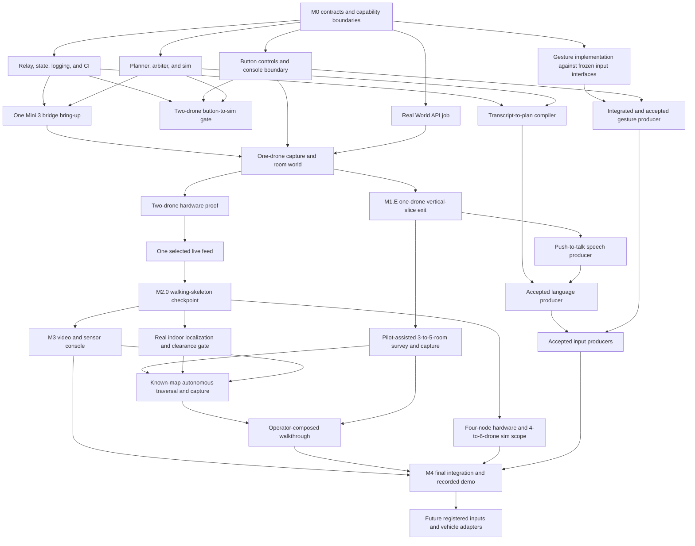

# Sweep MVP delivery plan

This plan turns the PRD into issue-ready work without creating a second delivery taxonomy. M0 through M4 are the canonical milestones. M1 proves button-driven room capture through one Mini 3 and Marble while gesture work proceeds against the same frozen input contracts. The transcript-to-plan compiler begins against two-drone sim and relay state; push-to-talk capture may begin after M1.E. M2 scales real hardware control to four Mini 3 nodes with live session membership. Real known-map autonomous indoor traversal becomes ready after M2.0. The lanes converge for the composed walkthrough and recorded demo.

The MVP targets a live technical demonstration. Production governance and operations move to F.6. All hardware-safety gates remain in the active milestones.

Interaction, Autonomy, and Platform define coordination and module boundaries. Any engineer may claim a ready item and own it through review, integration, and acceptance evidence.

Dynamic claiming has one safety exception. Changes to shared contracts or safety-critical code have one named change owner per change and require cross-review before merge. This applies to Intent v1, the adapter interface, relay state shape, the arbiter, e-stop, and safety-relevant planner paths.

## Dependency map

## Work breakdown

Each item below has enough boundary and acceptance detail to become an issue later. Dependencies refer to other item IDs in this plan.

Subtask IDs are stable historical identifiers referenced by existing issues. Removed or moved work leaves deliberate gaps.

### M0: Scope and contracts

**M0.1: Freeze the MVP boundary and capability areas**
Capability area: team. Dependencies: none.
Scope: approve the four DJI Mini 3 and RC-N1 sets on hand, paired with four Android bridge nodes, as the physical core MVP; retain 4 to 6 drones in simulation; make console buttons the reference producer for early intent-to-action testing while webcam gesture work proceeds against the same contracts; build the transcript-to-plan compiler against two-drone sim and relay state; stage push-to-talk capture after M1.E; move the Band to Future; and adopt dynamic task claiming with the contract and safety exception above.
Done when: the PRD has one milestone scheme, every core deliverable has a capability area and dependency boundary, and no optional input blocks M1 through M4.

**M0.2: Draft and freeze executable contracts**
Capability area: Platform, with Interaction and Autonomy review. Dependencies: M0.1.
Scope: freeze Intent v1 including `intent_id`, retry correlation, `capture_room`, `survey_area`, and `map_area`; telemetry, flight and camera adapters, live fleet membership, pose-anchored capture-bundle, WebSocket, source-registry, repository, `building`, `room`, and `capture` contracts; draft the World API-dependent `generation_job` fields; establish the shared input conformance runner and CI skeleton. The flight interface includes acknowledged yaw control. The camera interface includes capability discovery, gimbal positioning, readiness, native panorama, component capture, media retrieval, and typed unsupported results.
Done when: console-button fixtures exercise the real validator, unknown sources and invalid payloads are rejected, `intent_id` persists from draft through terminal state, a retry creates a new identifier linked to the failed request, planner motion semantics match the intent schema, `capture_room` requires confirmation and exactly one selected aircraft, `survey_area` authorizes recording and annotation but no autonomous motion, `map_area` requires confirmation and supplied map and room-graph inputs, every non-vendor state transition has one defined owner and terminal result, and the provisional World API fields are marked for M0.3 validation.

**M0.3: Prove a real World API job**
Capability area: Platform. Dependencies: M0.2, paid World API account and key.
Scope: submit one real `marble-1.1` multi-image request with three images and explicitly set `public: false`. Poll the operation and record the observed upload, operation, result, asset, and duration shapes. Revise the provisional records to match that evidence and freeze the `generation_job` contract. The Marble web app and mocked responses provide development evidence only.
Done when: the real job reaches `done=true` and returns a world ID, `world_marble_url`, and asset metadata; the observed fields have contract fixtures; and the reviewed record schema is frozen. If API access is unavailable, the M1 exit remains blocked.

#### Input channel coverage policy

Every current and future input channel targets full Intent v1 coverage over time. Coverage ships per channel and intent pair after measured accuracy for that pair clears a risk-scaled threshold. Lower-risk intents such as `select` and `capture_room` may qualify earlier. Safety-critical intents such as `estop`, `arm`, `takeoff`, and any intent that moves real hardware require a substantially higher threshold and may require redundant confirmation after they qualify. The numerical thresholds and redundant-confirmation rules are open owner decisions that must be frozen before accepting each pair. Console controls and the physical RC remain the trusted fallback for every safety-critical action.

Channels with a small realistic input space should approach full coverage sooner. A bounded gesture classifier can expand toward nearly every intent as its classes qualify. Voice has a much larger phrase space, so each voice and intent pair qualifies independently. Future channels, including the EMG band, follow the same policy and cannot remain permanently limited to an initial subset.

### M1: One-drone room-world vertical slice

#### Completed precursor: manual three-photo capture

Three guided phone photos have created one Marble room world. Preserve the photos, output, and observed quality as fallback evidence.

**M1.1: Build relay state, logging, and replay**
Capability area: Platform. Dependencies: M0.2.
Scope: first establish one authenticated WebSocket session and a live aircraft registry keyed by stable `drone_id`. The registry carries a monotonic `roster_version`, a connection epoch per aircraft, and `registered`, `ready`, `leaving`, `disconnected`, or `degraded` state. Signed join, readiness, graceful-leave, and unexpected-loss events update the registry. Up to four physical aircraft may register, disconnect, and rejoin without restarting the session. A joined node becomes selectable after identity, adapter capabilities, telemetry freshness, home pose, control authority, and RC-safety-operator presence pass. State fan-out, append-only JSONL, and backend replay use the same contract.
Done when: the checkpoint path authenticates the console and keyboard sources, logs every accepted or refused intent, acknowledgement, membership event, roster version, and connection epoch, derives canonical state and selection from current adapter telemetry, and preserves the history of disconnected aircraft. Join leaves current selection and accepted plan unchanged; the next dispatch applies roster-version validation. Reconnection increments the aircraft's connection epoch. Backend replay later reproduces the ordered intent, membership, and state history; replay UI is outside M2.0.

**M1.2: Build the deterministic autonomy and safety path**
Capability area: Autonomy. Dependencies: M0.2.
Scope: start with a two-drone flight sim and planner support for `arm`, `select`, `takeoff`, `translate`, `hold`, `come_home`, `land_all`, and `estop`. Represent the fleet as a collection keyed by registered aircraft ID; planner expansion, arbiter checks, and adapter dispatch iterate the selected registered aircraft. Acceptance fixtures select the exercised count. Every accepted plan records `roster_version`, and dispatch refuses a stale version. Joining preserves current selection and accepted plans. Graceful removal requires the aircraft to be landed, disarmed, and free of active tasks. Removal atomically clears that aircraft from selection and invalidates pending confirmations or plans built against the prior roster. Commands and acknowledgements carry the connection epoch; a prior epoch is refused. Unexpected or airborne loss takes the configured hold or fail-safe path, remains visible in state, and preserves physical RC authority. Spacing checks cover every ready airborne aircraft, including aircraft outside the command selection. Add a concrete simulated camera implementation with deterministic full-equirectangular and eight-frame fixtures plus injected unsupported-capability, camera, and download failures. Keep the full Intent v1 schema; preserve the M1-approved `capture_room` path during M2.0 and return `unsupported` for the remaining unearned names. Implement the complete arbiter checks for state, confirmation, geofence, ceiling, spacing, battery, link loss, positioning loss, and e-stop.
Done when: every checkpoint intent and planned command is checked, unsupported valid intents produce a typed refusal before planning, unsafe requests produce no adapter command, the camera protocol runs against the simulated implementation, and the two-drone scenarios pass deterministically. The conformance and scenario suite exercises registry sizes of 1, 2, 3, and 4 plus join, ready, graceful leave, unexpected loss, and rejoin. It also proves stale-roster dispatch refusal, prior-epoch command and acknowledgement rejection, plan invalidation, and spacing checks against unselected airborne aircraft. Adding a simulated or DJI node changes configuration and credentials while the schema and control flow stay stable. Camera fixtures prove `pano_360` and `reconstruct_8` result typing and failure handling before hardware. `come_home` remains planner behavior expressed through the existing adapter methods.

**M1.3: Connect button controls to Intent v1**
Capability area: Interaction. Dependencies: M0.2, M1.1.
Scope: isolate the real event-to-intent boundary and remove production use of the internal simulator. Build a Control/Capture module with a live aircraft registry and selector, capture-pattern selector, readiness reasons, `Capture room`, `Hold`, and supplemental network `E-stop` controls, plan preview, confirmation, and cancellation. For M2.0, show membership state, connection epoch, readiness or loss reason, selection, two active drone states, the last acknowledgement or refusal, keyboard network stop, and a slot for one selected live feed. Preserve departed nodes in session history. Ledger, health, and replay views follow after the checkpoint.
Done when: console-button and keyboard events produce accepted Intent v1 payloads; each request retains one `intent_id` and timestamps through draft, pending confirmation, sent, accepted or refused, executing, and completed or failed; every refusal or failure reason is visible; retries receive a new `intent_id` linked to the failed request; join, readiness, leave, unexpected loss, and rejoin update the registry and selector without reloading; stale selections and invalidated plans are cleared visibly; the checkpoint state is visible; and disconnects or send failures are shown without substitute commands or silent retry.

**M1.4: Pass the two-drone button-to-sim gate**
Capability area: team. Dependencies: M1.1, M1.2, M1.3.
Scope: run the M2.0 workflow through the production button controls, relay, planner, arbiter, and two-drone sim path: arm, select both, confirmed takeoff, translate together, hold, come home, confirmed land-all, with the network stop available throughout.
Done when: the workflow passes in simulation, a deliberate geofence violation is refused before an adapter command, e-stop reaches both simulated drones, configured link loss produces the safe behavior, CI is green, and the JSONL log explains the run.

**M1.5: Expand the sim path to the full scripted mission**
Capability area: Autonomy with Interaction and Platform integration. Dependencies: M1.4, M2.0.
Scope: add the formation, altitude, spacing, and sweep behaviors deferred by M2.0; expand the simulator and console from two drones to 4 to 6; run Appendix E through the production path.
Done when: 4 to 6 simulated drones complete Appendix E in under three minutes and the log contains zero unsafe intents.

**M1.9: Prove one DJI Mini 3 bridge node**
Capability area: Autonomy with Platform support. Dependencies: M0.2, M1.1, M1.2, delivered Mini 3, RC-N1, and candidate Android phone.
Scope: pin and record the exact Mini 3, RC-N1, Android model, aircraft/controller firmware, and Mobile SDK release. Build the smallest DJI-specific authenticated pilot app and bridge; do not introduce a generic edge-agent or protobuf layer. Render the DJI feed locally with `visual_advisory` coverage, quality, and readiness overlays. Prove SDK registration and connection, Virtual Stick, required telemetry fields and measured rate, runtime camera capabilities, photo and panorama behavior, media download, live-video extraction, and disconnect/watchdog behavior. Stream Virtual Stick commands at a tested rate within DJI's documented 5-to-25 Hz range. Reject out-of-order commands and commands older than the frozen local TTL at the bridge.
Done when: one node completes a sustained 15-minute bench and guarded-hover run while recording command RTT, jitter, drops, telemetry rate, end-to-end video latency and dropped frames, phone thermals, throttling, and battery draw. WebRTC glass-to-glass p95 remains below 300 ms; the report breaks out aircraft-to-controller, Android processing, and LAN delivery. The phone sustains control, telemetry, live decode and LAN relay together. Physical RC pause, takeover, RTH, and landing remain available after laptop, LAN, relay, or bridge failure. Camera evidence reports what this exact combination returns; a panorama symbol alone does not accept `pano_360`. [DJI Mobile SDK release notes](https://developer.dji.com/doc/mobile-sdk-tutorial/en/?pbc=D3IDBfR5&pm=custom) · [DJI Virtual Stick](https://developer.dji.com/doc/mobile-sdk-tutorial/en/tutorials/virtual-stick.html) · [Mini 3 specifications](https://www.dji.com/mini-3/specs)

**M1.E: Earn the one-drone room-world exit**
Capability area: team. Dependencies: M0.3, M1.1, M1.2, M1.3, M1.9.
Scope: let the operator create a room, have the RC safety operator pilot one connected Mini 3 to an approved hover pose, click Capture room, review the generated `capture_room`, and confirm it. The button emits the same Intent v1 envelope later sources use. The planner and arbiter dispatch only to the proven bridge. M1 permits capture yaw and gimbal actions while the pilot owns translation. The drone holds the approved pose, collects `pano_360` if verified or a separately confirmed `reconstruct_8`, downloads pose-anchored media, and starts one Marble job with `public: false`. Show asynchronous states and retry while preserving the capture.
Done when: the complete button request reaches a visible room world with matching room, capture, operation, world, asset, model, and timestamp records. Before confirmation, a `capture_readiness` guidance event reports pose, pilot-approved clearance, camera, storage, image quality, and coverage readiness plus a yaw or gimbal suggestion. The Android app shows local FPV, the coverage compass, readiness gates, and capture progress. The persistent laptop shell exposes Control, Live view, Capture library, World Builder, Connectivity, and Configuration modules at their M1 depth. `pano_360` accepts only a full equirectangular artifact; `reconstruct_8` remains labeled as incomplete vertical coverage. Injected invalid intent, stale command, telemetry, camera, download, link, bridge, and World API failures take the documented refusal, hold, or recovery path. The physical RC safety operator can pause, take over, return, or land throughout.

#### Drone capture geometry

The selected camera mode must have a measured horizontal field of view that satisfies the tested overlap target. A level yaw ring leaves floor and ceiling unseen and is labeled as incomplete vertical coverage. The `pano_360` pattern succeeds only with a valid full equirectangular artifact from the camera or a verified multi-row stitcher; otherwise it returns `unsupported`. The derivation and vendor evidence live in [DJI Mini 3 capture guidance](../RESEARCH/DJI_MINI_3_CAPTURE_GUIDANCE_DISPLAY_2026_09_02.md).

#### M1 room-world scope

The pending room-world slice uses Mini 3 capture in an empty, static room. World Labs says accepted jobs usually take about five minutes, so every room is an asynchronous job.

The output is an AI-generated room world. It carries no claim about hidden geometry, measurements, inventory, or safety. Every demo request sets `public: false` and uses disposable data from an empty staged room. People and pets remain outside the M1 capture set. Production access governance and retention policy move to post-demo hardening.

#### Follow-on speech scope

**The follow-on speech scope is bounded on purpose.** Whisper API capture and transcription sit on top of the accepted button-driven intent path and the reviewed transcript-to-plan slice. They add browser recording, relay upload, server-side key handling, error states, a manual smoke run, compiler integration, and preview and confirmation.

That scope holds for one-shot push-to-talk in the pinned Chromium browser, `en-US`, a working microphone and network, recordings capped at 30 seconds, and the `whisper-1` transcription endpoint. The final transcript enters the same compiler path that typed fixtures exercise. The compiler starts against authoritative two-drone sim and relay state as soon as the M1.1 and M1.2 interfaces stabilize; M1.5, M2.0, and real hardware sit outside its readiness gate. It targets the full Intent v1 vocabulary over time and enables each voice and intent pair only under the input channel coverage policy above. M4 owns offline transcription, multilingual support, and noisy-room hardening.

The Whisper path needs browser recording plus a relay endpoint because the API accepts an audio-file upload and the API key must stay off the client. OpenAI's [API key safety guidance](https://help.openai.com/en/articles/5112595-best-practices-for-api-key-safet) requires requests from browser clients to pass through a server that holds the key.

The 50 reviewed cases test transcript-to-plan behavior in CI. Microphone recognition evidence comes from the separate 20-utterance, two-speaker live run through the real browser capture path. Synthetic transcripts cannot satisfy speech acceptance.

### M2: Hardware control MVP

**M2.0: Pass the two-drone walking-skeleton checkpoint**
M2.0 is the next control checkpoint after the M1 one-drone room-world exit. It spans M1.1 through M1.4, M2.1 and M2.2, and the selected-feed slice of M3.1 while remaining within the M0 through M4 milestone series.

The checkpoint exercises the eight flight-control Intent v1 names `arm`, `select`, `takeoff`, `translate`, `hold`, `come_home`, `land_all`, and `estop`. The M1-approved `capture_room` path remains available at an operator-approved hover pose. Other unearned names, including `map_area`, return `unsupported`; unknown names and invalid arguments keep their existing validation refusals. The workflow is:

1. Arm.
2. Select both drones.
3. Take off after confirmation.
4. Translate both together.
5. Hold.
6. Come home.
7. Land both after confirmation.
8. E-stop at any point.

The one-drone proof selects the only connected drone and runs the same sequence and safety checks. The two-drone proof then replaces that selection with both connected drones and verifies coordinated translation and spacing.

The checkpoint keeps the arbiter, network stop, state and confirmation checks, geofence, ceiling, spacing, battery, link-loss and positioning-loss behavior, append-only JSONL audit log, and independent physical RC safety path. Every active aircraft has an RC safety operator. Gesture and transcript-to-plan compiler work may already be active, with push-to-talk capture available after M1.E. The formation library, altitude gesture mapping, sweep planner, detector, mosaic, replay UI, metrics dashboard, session report, and release polish start after this gate.

M2.0 passes when:

- the complete workflow passes in the two-drone simulator;
- one real drone passes before the second is added;
- two real drones complete the workflow without manual flight correction;
- a deliberate geofence violation is refused before an adapter command is sent;
- the network stop reaches both drones, link loss produces the configured safe behavior, and each RC safety operator can pause, take over, return, or land independently;
- the selected live video feed stays visible; and
- the JSONL log explains accepted commands, refusals, acknowledgements, state changes, and safety actions.
- a third or fourth simulated node joins, leaves while landed and disarmed, and rejoins during the same session; selection and dispatch follow the live registry throughout.
- one real node becomes ready, a second joins, and a landed and disarmed node gracefully leaves and reconnects in the same session; `roster_version`, connection epochs, selection, pending confirmation invalidation, telemetry, and the unaffected aircraft follow the membership contract.

**M2.1: Prove one-drone flight control**
Capability area: Autonomy. Dependencies: M1.E, M1.4, guards, and a contained flight space.
Scope: calibrate the accepted positioning and clearance systems, verify ground telemetry, and run the M2.0 workflow on the proven Mini 3 bridge node with one Sweep operator and one RC safety operator.
Done when: one Mini 3 completes the workflow with expected refusals and network-loss behavior, while physical RC pause, takeover, RTH, and landing remain independently available.

**M2.2: Prove two-drone hardware control**
Capability area: Autonomy, with bounded Interaction and Platform support. Dependencies: M1.4, M2.1.
Scope: duplicate the proven hardware stack for a second Mini 3 and run the eight-intent M2.0 workflow. Exercise spacing, geofence refusal, battery behavior, bridge and link loss, positioning loss, network stop, and physical RC takeover without adding the deferred feature set.
Done when: two real Mini 3 nodes complete the workflow without manual flight correction, every deliberate unsafe request produces the expected refusal, each bridge rejects stale and out-of-order commands, each physical RC remains usable, and the JSONL evidence explains the run.

**M2.3: Add hardware watchdog and session evidence**
Capability area: Platform. Dependencies: M1.1, M2.0.
Scope: add operator-presence enforcement, extended hardware log capture, and end-of-session reports. These are polished-MVP work after the checkpoint.
Done when: stale operator presence triggers the configured safe behavior and the report contains commands, refusals, telemetry, and timing.

**M2.4: Complete staged four-node flight acceptance**
Capability area: Autonomy, with bounded Interaction and Platform support. Dependencies: M1.5, M2.2, M2.3.
Scope: expand from the accepted two-node checkpoint to four matching Mini 3, RC-N1, and Android nodes; add altitude, formation, and sweep to the accepted checkpoint behaviors. Exercise the complete registry lifecycle with the fourth node, including readiness, landed and disarmed graceful leave, reconnection with a new epoch, and inclusion in the next confirmed plan. Keep the 4-to-6-drone proof in simulation. A simultaneous four-aircraft flight requires four physical RC safety operators; the live cycling proof may keep fewer aircraft airborne when staffing is limited.
Done when: four physical nodes pass Appendix E once on camera, the fourth-node lifecycle preserves audit history, increments `roster_version` and connection epoch, clears stale selection, invalidates stale plans, and leaves unaffected aircraft stable; 4 to 6 simulated drones pass the same scenarios; and every deliberate unsafe request produces the expected refusal.

**M2.6: Prove pilot-assisted multi-room survey and capture**
Capability area: Interaction with Platform integration. Dependencies: M1.E.
Scope: confirm `survey_area {area_id}`, then let the RC safety operator fly through 3 to 5 rooms while the user marks room entry, names, doorways, and candidate capture poses. Record both sides of every doorway and run `capture_room` at each approved pose. Store room adjacency, operator annotations, optional floor-plan reference, and any accepted metric pose evidence. Without an accepted shared pose source, label the output topological and keep it out of autonomous planning. Continue capturing while prior Marble jobs run.
Done when: one pilot-assisted project exposes each room's capture bundle, doorway evidence, graph, candidate pose, job state, and Marble world, and has no orphaned or cross-linked IDs. The pilot-assisted result can be composed into a complete walkthrough. Before M3 reuses it, the operator imports or validates a metric occupancy map, room graph, capture poses, and geofence through the M3 localization gate.

### M3: Video, sensor, and real known-map indoor capture

**M3.0: Prove indoor localization and deterministic clearance on the 416 Congress Level 1 map**
Capability area: Autonomy with Platform evidence support. Dependencies: M2.2, the validated 416 Congress Level 1 scan bundle (registered point cloud, room graph, obstacle primitives), printed and surveyed tag set.
Scope: Mini 3 provides only downward vision sensing; nothing onboard can observe a forward, rear, lateral, or upward obstacle in flight, and DJI does not document Virtual Stick obstacle avoidance for this aircraft. Use tag36h11 AprilTags as the shared indoor localization source, detected through `pupil-apriltags` or `cv2.aruco` on the live 1280×720/30 O2 downlink — the only resolution available off-board; 2.7K/4K are SD-card recording modes. Placement is hybrid: floor tags in formation zones and open areas, read near-nadir from the 1.5–2.4 m flight band, where 16 cm tags stay pose-grade at 720p; and wall tags along route tubes, sized 24–30 cm or spaced so at least one tag stays within roughly 2–2.5 m of every route point. The -90° to +60° gimbal supports both; ceiling tags remain excluded. Fuse fixes per drone in an EKF with delayed-measurement replay: predict with MSDK velocity, apply each tag fix at its capture time using per-configuration calibrated video latency, and re-propagate to now; use multi-tag joint PnP whenever two or more tags are visible and ambiguity gates (error-ratio, surveyed-normal prior, innovation gating) on single-tag fixes. Calibrate intrinsics for every camera and imaging configuration through the exact delivery pipeline at 1280×720. Clearance is deterministic, not sensed: static clearance comes from the validated scan-derived map — obstacle primitives, route tubes, formation volumes, and per-zone altitude bands with floors above the tallest furniture and ceilings below hanging fixtures — checked by the arbiter against the fused pose plus a stopping envelope; dynamic intrusion protection is the M3.3 detection-and-operator-confirmation path with one RC safety operator per aircraft; monocular depth remains advisory and may hold but never clear. A stale, missing, or contradictory source fails closed to hold, then land. Before any autonomy, run the axis-transpose probe for the documented Mini-class pitch/roll frame swap, and keep the command path on a 10–20 Hz resend loop with an app-side deadman that decays to zero velocity then LAND — never RTH indoors. The room graph records the corrected transitions as two separate edges: 113 west side ↔ mezzanine connection, and 113 east side ↔ north hallway entrance; the north hallway spine enters through the east side of 113. Map artifacts are `manifest.yaml`, `tags.yaml`, `obstacles.yaml`, and `zones.yaml`, plus scan registration with saved transforms and residuals, a tag-pose extractor with golden fixtures, a map validator covering unique IDs, units, transforms, source version, and missing fields, and a point-cloud preview showing tag axes and the formation volume. Marble output never supplies placement geometry.
Delivery levels — M3A through M3C are committed; M3D and M3E are the ambitious path:
- M3A, mapping MVP: one launch and return zone, one validated route to the flat landing in 110, one formation box in the 110 atrium, and only the rooms and connector geometry touching that route; record both 113 transitions but stop autonomous coverage at their boundaries. Done when held-out map checkpoints are within 0.10 m of measured locations, three or more tags are detected through the actual Mini 3 live stream at the intended distance and speed, and a hand-carried camera traverses the route with no unhandled localization gap over 500 ms.
- M3B, localization proof: one drone completes five route, hold, and return rehearsals with p95 position error at or below 0.25 m, and covering the active tag set or loading a wrong map version commands hold before further translation.
- M3C, small swarm proof: two drones enter the 110 box sequentially, occupy two fixed line slots, hold separation, and leave sequentially.
- M3D, full Level 1 (ambitious): 101, 106, 110, 113, and the north hallway in one shared map with the corrected 113 transitions; the mezzanine stays lane-only; 113 becomes a backup formation zone only if measured furniture and ceiling bounds pass.
- M3E, final formation proof (ambitious): four drones demonstrate line, column, wedge, and diamond with sequential transitions and no crossed paths, plus an operator-confirmed controlled-target escort that stays inside the approved 110 volume and stops on target loss, localization staleness, or intrusion.
Explicit MVP cuts: no automatic ARKit tag mapper, no full placement optimizer, no autonomous north-hallway route, no autonomous mezzanine flight, no dynamic avoidance, no escort behavior, and no simultaneous four-drone formation transitions.
Done when: M3A through M3C acceptance passes with calibration, latency-calibration, registration, and validator artifacts preserved, and injected stale or missing data commands hold. Until then, `map_area` returns `unsupported`. This structure supersedes the earlier wall-only placement and the per-direction staged-approach clearance gate: three of the five protected directions are physically unobservable by this aircraft, so clearance certification is deterministic map-plus-pose evidence rather than sensing trials. [DJI Virtual Stick obstacle-avoidance support](https://developer.dji.com/api-reference-v5/Components/IVirtualStickManager/IVirtualStickManager.html) · [Mini 3 sensing specifications](https://www.dji.com/mini-3/specs)

Owner decision: add floor metadata to the validated room graph, associate each tag with its graph floor (Level 1 and the mezzanine branch are distinct graph regions), and keep one flat building-wide tag-ID namespace. Do not reserve fixed ID ranges per floor; dense floors may need 50 or more tags and exhaust an assigned range.

**M3.1: Establish media ingest and recording**
Capability area: Platform with Interaction integration. Dependencies: M1.1 and one camera source. The M2.0 slice also depends on M2.2.
Scope: first keep one selected live feed visible through the M2.0 run. After the checkpoint, configure MediaMTX ingest, WebRTC and MJPEG serving, recording, stream naming, and latency measurement.
Done when: M2.0 can display the selected feed throughout its run. Full M3.1 exits when one source also streams and records reliably within the latency budget, then four Mini 3 nodes meet the same gate together. Five-to-six-source hardware remains Future work.

**M3.2: Build the camera and sensor dashboard**
Capability area: Interaction. Dependencies: M1.3, M3.1.
Scope: add the live mosaic, focus pane, focus-by-selection, telemetry and sensor state, attention state, and clear degraded-source status.
Done when: the operator can select a drone, inspect its live camera and sensor state, and see stream or telemetry failures without affecting flight control.

**M3.3: Add detection events and operator confirmation**
Capability area: Interaction with Platform integration. Dependencies: M3.1, M3.2.
Scope: sample frames, run the detector, emit timestamped detection events, promote attention, and require operator confirmation before detections affect swarm behavior.
Done when: a qualifying detection promotes the selected feed within one second, all events are logged, and no detection emits a command.

**M3.4: Prove known-map autonomous multi-room traversal and capture**
Capability area: Autonomy with Platform and Interaction integration. Dependencies: M1.E, M2.2, M3.0, M3.1, a supplied occupancy map and approved room poses.
Scope: the operator first imports or creates the occupancy map, marks and validates the room graph and approved capture poses, and approves the geofence. The console or language path then previews `map_area {area_id}` for one explicit batch confirmation. Freeze the selected aircraft, map version, room assignments, approved poses, routes, and capture patterns into that authorization. Execute it through one drone in a fixed 3-to-5-room, single-floor test area, then let two selected drones partition the same known targets, maintain separation, collect complete bundles, and return home. The planner resolves the supplied occupancy map, room graph, and approved capture poses into collision-checked routes and internal room-capture tasks. Each route segment and capture is revalidated immediately before dispatch; a changed selection or plan invalidates confirmation, while stale or unsafe state fails closed to hold or the configured fail-safe. Use open doors, a static empty area, no stairs, no people or pets, guarded aircraft, a known launch and return zone, an operator present, and one physical RC safety operator per active aircraft. Marble receives media only after the flight path has completed its conventional safety checks.
Done when: one-drone evidence passes before the two-drone trial, then the two-drone workflow passes once on camera with no manual flight correction. Every reachable room receives one complete pose-anchored bundle; no planned path crosses an occupied cell or minimum-clearance boundary; no separation violation occurs; every aircraft returns or executes its configured fail-safe; and the room catalog has no missing, duplicate, or cross-linked captures. Capture bundles from the accepted run complete per-room World API jobs with `public: false`, and every returned room world links to the same building, room, capture, and generation records.

**M3.5: Earn the control and media exit**
Capability area: team. Dependencies: M2.4, M3.2, M3.3, M3.4.
Scope: demonstrate button control, plus each accepted language or gesture producer, with the camera, telemetry, sensor console, and known-map autonomous multi-room traversal and capture path active.
Done when: the complete operator workflow succeeds on four physical Mini 3 nodes and 4 to 6 simulated drones, known-map autonomous multi-room traversal and capture succeeds on the accepted two-drone configuration, and the session evidence supports every control, safety, video, sensor, membership, and capture claim.

### M4: Language completion and final proof of concept

**M4.1: Complete deterministic language resolution**
Capability area: Autonomy. Dependencies: frozen Intent v1 plus the M1.1 relay-state and M1.2 two-drone sim interfaces. Coverage for each intent also depends on that capability's acceptance gate; formation, altitude, spacing, and sweep coverage depends on M1.5.
Scope: compile voice into the full Intent v1 vocabulary as each voice and intent pair clears the input-channel accuracy gate. Start with `capture_room`, then expand through `arm`, `select`, `takeoff`, `translate`, `hold`, `come_home`, `land_all`, and `estop` as their control and risk gates pass. Add `disarm`, `land`, `altitude`, `formation_next`, `formation_set`, `spacing`, `sweep`, `survey_area`, and `map_area` when their planner, capability, and channel-accuracy gates pass. Implement ordered plans plus bounded selection and location resolution with explicit ambiguity and refusal results. Use authoritative relay, selection, room, pose, camera, and capability state; validate and preview every plan before emission.
Done when: reviewed utterances for every earned voice intent produce the exact ordered Intent v1 plans or explicit ambiguity and refusal results. Resolver tests cover IDs, current selection, supported relative phrases, stale state, unavailable capabilities, ambiguity, and unresolved locations without bypassing preview, confirmation, the planner, or the arbiter.

**M4.2: Complete language evaluation and fallback**
Capability area: Platform, with team-contributed cases. Dependencies: M4.1.
Scope: build the 20-utterance live set, complete its cached and live eval paths, add the local compiler fallback, and close the failure cases needed by the scripted demo.
Done when: the 20-utterance live set passes once on camera, unsafe-intent count is zero, cached fixtures are produced by real compiler runs, and fallback uses the same validation path.

**M4.3: Harden speech UX and evaluate offline transcription**
Capability area: Interaction with Platform support. Dependencies: M0.2, M1.3, M1.E.
Scope: add one-shot push-to-talk recording and server-side Whisper transcription, then evaluate noisy-room speech, retries, timeouts, and a local transcription fallback if offline evidence requires it. Continuous listening is time-permitting stretch work after the push-to-talk path passes and does not gate M4.3 or the MVP. Polish transcript, preview, clarification, confirmation, and refusal behavior. M4.1's reviewed result interface gates compiler integration, not capture and transcription development.
Done when: the primary Whisper API path and any approved local fallback feed M4.1's reviewed transcript-to-plan result interface and cannot bypass preview, confirmation, planner, or arbiter checks.

**M4.4: Add the webcam gesture producer**
Capability area: Interaction with Platform support. Development dependencies: frozen M0.2 and M1.3 interfaces. Integration and acceptance dependency: completed M1.3.
Scope: build and test the second input channel beside the button-first path with a laptop webcam and simulated relay state while M1.3 is underway. Integrate it only after M1.3 completes. Add camera selection, explicit gesture-tracking enablement, hand-landmark overlay, confidence and dwell feedback, candidate preview, confirmation, cancellation, duplicate suppression, and the shared `intent_id` lifecycle. Start with MediaPipe's built-in gesture classes for `capture_room`, `hold`, confirm, and cancel, then expand the bounded classifier vocabulary toward full Intent v1 coverage. Each gesture and intent pair ships only after clearing its risk-scaled accuracy gate. `estop`, `arm`, `takeoff`, and free-flight motion remain on console controls or the physical RC until their gesture-specific safety gates pass; those trusted fallbacks remain available afterward.
Done when: completed M1.3 supplies the accepted integration path, and one recorded browser session selects a camera, enables tracking, shows landmarks, proposes `capture_room`, confirms it, and observes the same `intent_id` through execution and terminal state. Cancellation, hold, timeout, camera unplug, low confidence, and duplicate suppression pass. Every enabled pair has measured evidence above its frozen threshold, and the gesture producer passes the same Intent v1 conformance suite as console buttons.

Placement decision: this early-start work keeps its historical M4.4 identifier. Existing issues and plan references retain the stable ID.

Readiness decision: gesture development begins against frozen M1.3 interfaces while M1.3 is underway. M1.3 completion gates integration and acceptance.

**M4.5: Integrate and record the demo**
Capability area: team. Dependencies: M2.4, M2.6, M3.5, M4.2, M4.3, M4.4.
Scope: repeat the accepted indoor known-map capture through one language or gesture producer, then add the room worlds generated from M3.4's accepted drone run to Marble Studio Compose. Manually place, rotate, and scale them against room adjacency and the floor-plan reference, align floors and doorways, review each transition, create a camera path in Studio Record, download the MP4 before leaving the page, and upload it to the same building project. Preserve and label captured, generated, composed, and enhanced artifacts. Finish the visible failure states, short run guide, demo script, and reel.
Done when: the confirmed “Map this floor” chain is traceable from its source through `map_area`, the accepted capture bundles and World API jobs to a 3-to-5-room composition; every doorway transition is reviewed; and the stored MP4 visits each room once. The selected language or gesture producer completes the accepted indoor mission through the same planner, arbiter, adapter, localization, clearance, geofence, separation, and physical-RC safety path. All claimed control and capture exits have recorded evidence, CI is green, and a fresh checkout can run the scripted demo from the guide. Record paths and enhanced video are downloaded during the Studio session because World Labs says they do not persist after leaving the page.

### Future

**F.1: Add optional input sources**
Capability area: Interaction with Platform registration support. Dependencies: M4.5 and a concrete source with host access.
Scope: add an EMG band through a source-specific producer, registry entry, shared conformance runner, and per-intent accuracy gates. Begin with the most important reliable mappings, then expand toward full Intent v1 coverage as each pair qualifies.
Done when: every enabled EMG and intent pair clears its frozen risk-scaled threshold, real source events pass Intent v1 conformance, and the same safety path works without relay, planner, arbiter, or adapter redesign.

**F.2: Extend vehicle portability**
Capability area: Autonomy with Platform eval support. Dependencies: working M2 evidence and the capability/action eval harness.
Scope: expand beyond the four-aircraft MVP when additional hardware plus staffing, RF, video, positioning, and clearance evidence supports it. Evolve capability contracts and add one evidence-backed vehicle adapter at a time.
Done when: unsupported behavior returns a typed refusal and no input or model calls an adapter directly.

**F.3: Automate spatial capture and exploration**
Capability area: Autonomy with Platform and Interaction integration. Dependencies: M3.4, a conventional mapping stack, and measured accuracy gates.
Scope: evaluate automatic room registration, a branded multi-room Spark renderer, metric alignment through SLAM, photogrammetry, or LiDAR, time-indexed rescans, Atlas integration, and autonomous exploration of an initially unmapped area. Onboard VIO plus depth or LiDAR must produce the occupancy map used by the planner. Marble remains a downstream presentation layer.
Done when: each capability has its own measured geometry, localization, coverage, and safety acceptance. Generated Marble content never supplies occupancy, clearance, geofence, collision, or position truth.

**F.4: Add description-guided person and object search**
Capability area: Interaction with Platform and Autonomy integration. Dependencies: M3.3, M3.4, reviewed evaluation sets.
Scope: add one confirmed `search_area {area_id, query_id}` outcome intent backed by a stored, bounded `perception_query`. Voice or text supplies permitted clothing, accessory, or object attributes; gestures select the search area and confirm or cancel. Perception emits candidate, progress, and completion events with source-frame and pose provenance and never emits motion. Exclude face identity, autonomous following, and autonomous approach.
Done when: the planner searches only the confirmed area through the normal arbiter path, description matching meets its reviewed evaluation gate, every candidate requires human validation, and expiration or cancellation stops the search without leaving an active query.

**F.5: Extend outdoor mapping and perception**
Capability area: Autonomy with Platform and Interaction evidence support. Dependencies: M4.5 and separate measured acceptance plans.
Scope: define a separate real-hardware outdoor program for geofencing, direct formation movement, fixed altitude offsets, pairwise hard-stop behavior, occupancy-grid routing with A*, carrot-chasing along multi-waypoint GPS routes, ORCA reciprocal collision avoidance, Hungarian or dynamic slot assignment, and obstacle-aware formation transitions. Then, in the original Stretch order, add ODM survey output, a height map, and altitude-band occupancy grids; add a Depth Anything V2 forward brake that scales velocity to zero under a tested 8 m threshold; yaw toward travel before translation and point the gimbal down before descent; stop and climb 5 m when validated YOLO evidence places a person within about 10 m; and project detections from one 40 m nadir-view aircraft into the live grid. Simulation may support engineering tests and cannot earn the product exit.
Done when: each item has its own real-hardware, evidence-backed accuracy, latency, failure, and safety gate before it can affect commanded velocity or occupancy state.

**F.6: Harden the proof for production use**
Capability area: team. Dependencies: M4.5 and an owner decision to pursue real-user deployment.
Scope: add access-control verification, retention and deletion policy, multi-user administration, operational and cost reporting, the 200-item language evaluation, extended random-motion gesture evaluation, five-run indoor hardware repeatability, parameter sweeps, RF and latency stress, broader failure campaigns, packaging, deployment automation, and rollback procedures.
Done when: each selected production concern has an owner, a measurable gate, and evidence from the target deployment environment.

## Confirmed parallel lanes

**Confirmed decision: gesture work begins alongside the button-first path against frozen M1.3 input interfaces. M1.3 completion gates its integration and acceptance. The transcript-to-plan compiler begins against the M1.1 relay state and M1.2 two-drone sim interfaces. Push-to-talk capture may begin after M1.E, and indoor-autonomy work becomes ready after M2.0.** M4.1, M4.3, and M4.4 have no M3 dependency. M4.5 is the convergence point after accepted input producers and the M3 indoor-autonomy exit are complete. Shared-file and review gates still serialize safety-critical and contract changes.

This development-versus-integration boundary applies throughout the plan: work may begin against a dependency's frozen interfaces while that dependency is underway, but integration and acceptance require the listed dependency to complete.

| Work package | Parallelization boundary |
|---|---|
| Full language compiler, state context, validation, logging, ordered emission, and eval plumbing | Plan schema, relay state shape, and ordered emission use one change owner and cross-review. |
| Whisper API capture, language UI, full resolvers, corpus completion, offline evaluation, and speech hardening | Corpus writing and the live speech smoke run can fan out. Resolver and UI integration wait on frozen result envelopes. |
| Media ingest, recording, stream naming, detection-event transport, and latency measurement | Media configuration can proceed independently. Detection and relay-state changes use one change owner and cross-review. |
| Mosaic, focus, sensor state, detector, attention promotion, and confirmation | Detector experiments can run independently. Console integration overlaps the language UI files. |
| Room project, World API jobs, room catalog, and Studio composition | The manual capture proof is complete. Persistent room-project work can proceed after M1.E. Shared console and persistence changes merge through one owner. Studio composition stays operator-assisted. |
| Drone scaling and known-map autonomous multi-room traversal and capture | M1.E proves capture at one approved hover pose. Translation and fleet scaling proceed through M2.0; M3 proves known-map traversal on one aircraft before two. Every safety-relevant planner or adapter change receives cross-review. |
| Cross-stack review, end-to-end acceptance, and defect margin | Safety-path and shared-contract reviews cannot be self-approved or merged concurrently. |

Before M2.0, the gesture producer, transcript-to-plan compiler, corpus authoring, and compiler evaluation fixtures may proceed as their input contracts freeze. MediaMTX recording and multi-stream setup, detector prototyping, and human room-project UX join the parallel work at their listed gates. Safety- or contract-gated pieces are Intent v1 and plan-schema changes, relay state and detection-event shapes, camera capability and capture-bundle contracts, `validate_plan` and ordered emission, arbiter or e-stop changes, and safety-relevant planner work. Each gated change has one named change owner and a different reviewer.

The parallel lanes:

1. Freeze the transcription request/response, plan result, detection-event, and stream-naming contracts. Each contract has one change owner and a different reviewer.
2. Begin the M4.1 compiler against the M1.1 and M1.2 sim contracts, and begin M4.4 beside M1.3 once its listed contracts freeze. Begin M4.3 push-to-talk capture after M1.E. These input lanes may land before or alongside M3.0 and M3.4. Room-project UX, MediaMTX work, detector prototyping, corpus authoring, cached evaluation fixtures, and speech smoke preparation may proceed with their frozen input contracts.
3. Use the accepted M1 one-node capture as the hardware baseline. M3.0 earns shared indoor localization and directional clearance, then M3.4 proves known-map traversal on one aircraft before two. M3 mosaic, sensor, and detection work proceeds beside those gates.
4. Begin M4.5 after the accepted input producers and M3.5 are complete. It joins the input path, the real indoor known-map mission, and the operator-composed walkthrough. Shared console changes merge through one owner at a time.
5. Continue delivery-gated M2 work in booked blocks while the input lane advances independently. Hardware bookings define the autonomy lane's pace.
